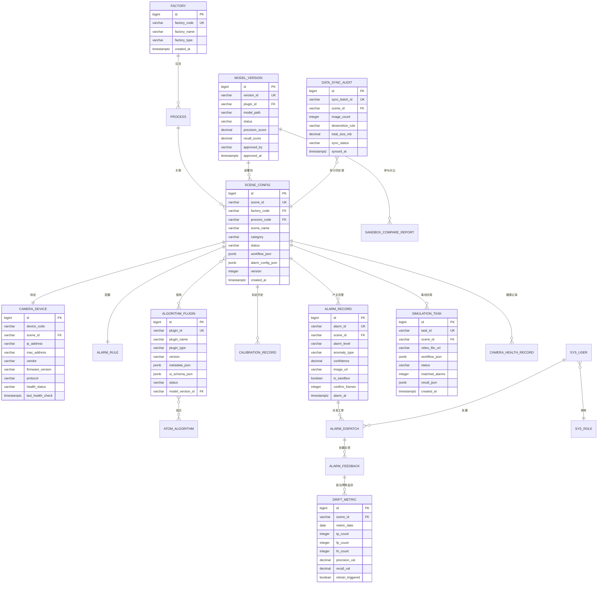
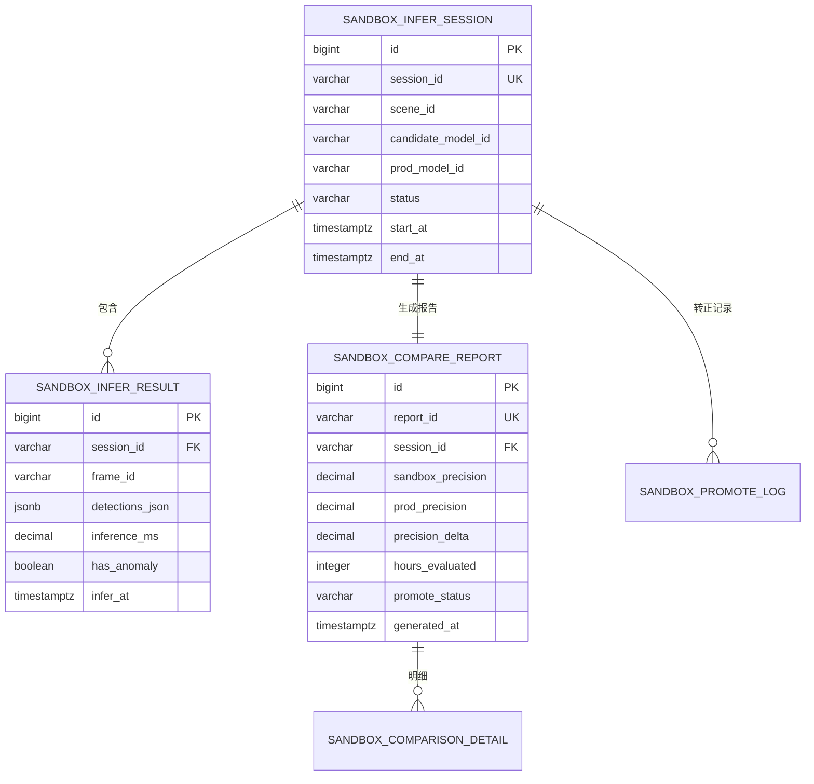
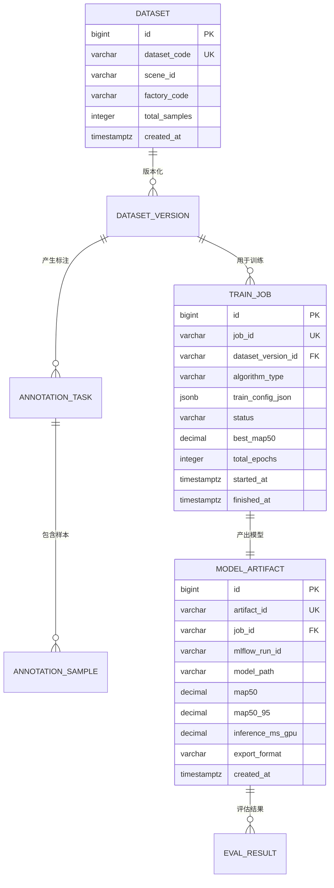

# 天柱·天镜 · 工业视觉 AI 推理平台
# 数据库设计文档（Database Design）

> **版本**：V2.1 · **日期**：2026-03-31 · **密级**：内部文件
> **适用数据库**：PostgreSQL 16（关系型）· TDengine 3（时序型）
> **关联文档**：方案 V2.0 · Sprint 计划 V2.0 · CLAUDE.md
>
> **V2.0 修订说明**（依据专家审查意见）：
> 1. **架构闭环补充**：新增 `data_sync_audit`（安全网闸数据传输审计）和 `simulation_task`（低代码离线仿真任务）两张表，填补等保合规盲区和调试闭环缺口
> 2. **TDengine 字段修正**：移除 `infer_result` 超级表中溢出风险高的 `bbox_json` 大字段，改为轻量统计字段 + MinIO URL 引用方案
> 3. **算法插件增强**：`algorithm_plugin` 表新增 `ui_schema_json` 字段，支撑低代码编排器属性面板的动态表单渲染
> 4. **设备资产补全**：`camera_device` 表补充 `mac_address`（接入鉴权）、`firmware_version`（兼容排查）、`vendor`（厂商管理）三个字段
> 5. **软删除唯一索引修正**：将所有含 `is_deleted` 的业务唯一约束从 `CONSTRAINT UNIQUE` 改为部分索引（Partial Index），解决软删除后同编码重注册报错问题
> 6. **Redis 缓存架构说明**：在总体规划中补充热加载缓存机制说明，明确 `scene_config` 激活版本的 Redis 缓存策略
>
> **V2.1 修订说明**（依据 Sprint 计划 V2.0 调整）：
> 7. **新增 `replay_session` 表**：支撑录像回放服务（实验室阶段的摄像头替代方案），记录每次回放会话的参数、状态和帧统计
> 8. **`algorithm_plugin` 表补充 `infer_backend` 字段**：标识推理后端类型（LOCAL_GPU / CLOUD_API / ONNX_CPU），支撑云端推理代理在实验室阶段与本地 GPU 推理的透明切换
> 9. **Redis 缓存补充**：新增云端推理代理健康状态缓存条目说明
> 10. **`dataset` 表 `source_type` 枚举扩展**：增加 `LAB_REPLAY` 类型，标识来源为录像标注的数据集

---

## 目录

1. [数据库总体规划](#1-数据库总体规划)
2. [实体关系图（ERD）](#2-实体关系图erd)
3. [生产库（tianjing_prod）表设计](#3-生产库-tianjing_prod-表设计)
4. [Sandbox 库（tianjing_sandbox）表设计](#4-sandbox-库-tianjing_sandbox-表设计)
5. [训练库（tianjing_train）表设计](#5-训练库-tianjing_train-表设计)
6. [时序库（TDengine）表设计](#6-时序库-tdengine-表设计)
7. [索引策略](#7-索引策略)
8. [分区策略](#8-分区策略)
9. [字段注释规范](#9-字段注释规范)
10. [数据字典](#10-数据字典)
11. [初始化数据](#11-初始化数据)
12. [Flyway 迁移脚本规范](#12-flyway-迁移脚本规范)

> **生产库表清单（V2.1，共 18 张）**：factory · process · scene_config · scene_config_history · camera_device · camera_health_record · calibration_record · algorithm_plugin · model_version · alarm_rule · alarm_record · alarm_dispatch · alarm_feedback · drift_metric · data_sync_audit · simulation_task · **replay_session（★V2.1 新增）** · sys_user · sys_role · sys_user_role · sys_operation_log

---

## 1. 数据库总体规划

### 1.1 多库隔离架构

```
┌─────────────────────────────────────────────────────────────────┐
│                     PostgreSQL 16 实例                           │
│                                                                  │
│  ┌─────────────────┐  ┌──────────────────┐  ┌────────────────┐ │
│  │  tianjing_prod  │  │ tianjing_sandbox  │  │ tianjing_train │ │
│  │  （生产库）      │  │  （实验室库）      │  │  （训练库）     │ │
│  │                 │  │                  │  │                │ │
│  │  场景配置        │  │  实验室推理结果    │  │  数据集元数据   │ │
│  │  设备管理        │  │  模型对比分析      │  │  标注任务      │ │
│  │  告警规则        │  │  评估报告         │  │  训练作业      │ │
│  │  用户权限        │  │                  │  │  模型评估      │ │
│  │  工作流编排      │  │  【仅Sandbox服务   │  │              │ │
│  │  告警记录        │  │    可访问】        │  │  【仅训练环境   │ │
│  │  模型漂移        │  │                  │  │    可访问】    │ │
│  │  感知健康        │  └──────────────────┘  └────────────────┘ │
│  │  ★数据同步审计   │                                            │
│  │  ★离线仿真任务   │                                            │
│  └─────────────────┘                                            │
└─────────────────────────────────────────────────────────────────┘

┌─────────────────────────────────────────────────────────────────┐
│                     TDengine 3 实例                              │
│                                                                  │
│  超级表：infer_result      超级表：camera_health_ts              │
│  超级表：alarm_timeseries  超级表：drift_metric_ts               │
│                                                                  │
│  【按 scene_id + is_sandbox 分区，生产与 Sandbox 数据物理隔离】    │
│  【★infer_result 移除大字段 bbox_json，改为 anomaly_count+URL 】  │
└─────────────────────────────────────────────────────────────────┘

┌─────────────────────────────────────────────────────────────────┐
│                     Redis 7 缓存层（★V2.0 新增说明）              │
│                                                                  │
│  Key 前缀：tianjing:scene:active:{scene_id}                      │
│  内容：scene_config 激活版本完整 JSON（含 workflow / algo /       │
│        alarm / roi 四块配置），TTL = 0（永久，变更时主动失效）     │
│                                                                  │
│  更新机制：scene_config 写入成功后，lowcode-workflow-service      │
│  通过 Nacos 配置变更事件广播 → route-dispatch-service 订阅事件   │
│  → 主动 DEL 旧 Key → 重新从 PostgreSQL 加载并 SET 新 Key         │
│  目的：降低路由引擎高频读的 PostgreSQL 压力，实现亚毫秒级配置读取  │
│                                                                  │
│  ★V2.1 新增：云端推理代理健康状态缓存                             │
│  Key 前缀：tianjing:cloud:proxy:health:{provider}                │
│  内容：JSON，{status:"UP|DOWN", latency_ms:int,                  │
│        last_check:ISO8601, consecutive_failures:int}             │
│  TTL = 60 秒（定时健康探针刷新，60s 超时自动视为 DOWN）            │
│  使用方：cloud-inference-proxy 每 30s 探一次并写缓存；            │
│  route-dispatch-service 读此 Key 决策是否降级到本地 ONNX          │
└─────────────────────────────────────────────────────────────────┘
```

### 1.2 数据库职责边界

| 数据库 | 服务访问权限 | 数据类型 | 保留策略 |
|---|---|---|---|
| `tianjing_prod` | 所有生产服务（读写）；Sandbox 服务（只读场景配置） | 配置、元数据、告警、用户、**数据同步审计、仿真任务** | 永久保留 |
| `tianjing_sandbox` | sandbox-infer-service（读写）；compare-dashboard-service（只读） | 实验室推理结果、对比分析 | 90 天滚动删除 |
| `tianjing_train` | 训练环境服务（读写）；禁止生产服务访问 | 数据集元数据、训练作业、标注 | 永久保留 |
| TDengine（生产） | 推理服务（写）；看板服务（读）| 高频时序推理结果、告警时间线（**已移除 bbox_json**） | 180 天 |
| TDengine（Sandbox） | sandbox-infer-service（写）；对比服务（读） | 实验室推理时序结果 | 30 天 |
| Redis 7（缓存） | route-dispatch-service（读写）；lowcode-workflow-service（写失效） | scene_config 激活版本热缓存，Key=`tianjing:scene:active:{scene_id}` | 永久（变更时主动失效） |

### 1.3 全局字段规范

所有 PostgreSQL 表必须包含以下标准字段：

```sql
-- 所有表必须具备的标准字段
id          BIGSERIAL    PRIMARY KEY,               -- 自增主键，内部使用
scene_id    VARCHAR(64)  UNIQUE NOT NULL,           -- 业务主键（仅适用有 scene_id 的表）
created_at  TIMESTAMPTZ  NOT NULL DEFAULT NOW(),    -- 创建时间（带时区）
updated_at  TIMESTAMPTZ  NOT NULL DEFAULT NOW(),    -- 最后更新时间（触发器自动维护）
created_by  VARCHAR(64)  NOT NULL,                  -- 操作人（用户名或服务名）
updated_by  VARCHAR(64)  NOT NULL,                  -- 最后修改人
version     INTEGER      NOT NULL DEFAULT 1,        -- 乐观锁版本号
is_deleted  BOOLEAN      NOT NULL DEFAULT FALSE     -- 逻辑删除标记
```

---

## 2. 实体关系图（ERD）

### 2.1 生产库核心实体关系



### 2.2 Sandbox 库实体关系



### 2.3 训练库实体关系



---

## 3. 生产库（tianjing_prod）表设计

### 3.1 厂部表 `factory`

```sql
-- ============================================================
-- 表名：factory
-- 说明：钢铁厂部基础信息，是所有场景的顶层分类维度
-- 业务域：基础数据
-- 写入频率：极低（初始化写入，后续几乎不变）
-- ============================================================
CREATE TABLE factory (
    id           BIGSERIAL     PRIMARY KEY,
    factory_code VARCHAR(32)   NOT NULL,                -- 厂部编码，如 PELLET / SINTER / STEEL / SECTION / STRIP
    factory_name VARCHAR(64)   NOT NULL,                -- 厂部名称，如 球团厂 / 烧结厂 / 炼钢厂
    factory_type VARCHAR(32)   NOT NULL,                -- 厂部类型：RAW_MATERIAL / SMELTING / ROLLING
    sort_order   SMALLINT      NOT NULL DEFAULT 0,      -- 展示排序序号
    remark       VARCHAR(255)  NULL,                    -- 备注说明
    is_deleted   BOOLEAN       NOT NULL DEFAULT FALSE,
    created_at   TIMESTAMPTZ   NOT NULL DEFAULT NOW(),
    updated_at   TIMESTAMPTZ   NOT NULL DEFAULT NOW(),
    created_by   VARCHAR(64)   NOT NULL,
    updated_by   VARCHAR(64)   NOT NULL,
    version      INTEGER       NOT NULL DEFAULT 1,

    CONSTRAINT uk_factory_code UNIQUE (factory_code)
);

COMMENT ON TABLE  factory              IS '厂部基础信息表';
COMMENT ON COLUMN factory.factory_code IS '厂部编码，全局唯一，取值：PELLET（球团）/ SINTER（烧结）/ STEEL（炼钢）/ SECTION（型钢）/ STRIP（带钢）';
COMMENT ON COLUMN factory.factory_type IS '厂部类型：RAW_MATERIAL=原料加工，SMELTING=冶炼，ROLLING=轧制';
COMMENT ON COLUMN factory.sort_order   IS '页面展示排序，数字越小越靠前';
```

---

### 3.2 工序表 `process`

```sql
-- ============================================================
-- 表名：process
-- 说明：厂部内的生产工序，是场景分类的二级维度
-- 业务域：基础数据
-- ============================================================
CREATE TABLE process (
    id           BIGSERIAL    PRIMARY KEY,
    process_code VARCHAR(64)  NOT NULL,                 -- 工序编码，如 CHAIN_GRATE / SINTERING_MACHINE
    process_name VARCHAR(128) NOT NULL,                 -- 工序名称，如 链篦机 / 烧结机 / 转炉车间
    factory_code VARCHAR(32)  NOT NULL,                 -- 所属厂部编码，关联 factory.factory_code
    sort_order   SMALLINT     NOT NULL DEFAULT 0,
    is_deleted   BOOLEAN      NOT NULL DEFAULT FALSE,
    created_at   TIMESTAMPTZ  NOT NULL DEFAULT NOW(),
    updated_at   TIMESTAMPTZ  NOT NULL DEFAULT NOW(),
    created_by   VARCHAR(64)  NOT NULL,
    updated_by   VARCHAR(64)  NOT NULL,
    version      INTEGER      NOT NULL DEFAULT 1,

    CONSTRAINT uk_process_code    UNIQUE (process_code),
    CONSTRAINT fk_process_factory FOREIGN KEY (factory_code)
        REFERENCES factory(factory_code) ON UPDATE CASCADE
);

COMMENT ON TABLE  process              IS '生产工序表，隶属于厂部';
COMMENT ON COLUMN process.process_code IS '工序编码，全局唯一';
COMMENT ON COLUMN process.factory_code IS '所属厂部编码，外键关联 factory.factory_code';
```

---

### 3.3 场景配置表 `scene_config`

```sql
-- ============================================================
-- 表名：scene_config
-- 说明：视觉识别场景核心配置，是平台最重要的业务主表。
--       每行对应一个摄像头视角+算法+告警的完整配置单元。
-- 业务域：场景管理
-- 写入频率：低（场景新增/修改时写入）
-- 读取频率：极高（每次推理路由时读取）
-- ============================================================
CREATE TABLE scene_config (
    id               BIGSERIAL     PRIMARY KEY,
    scene_id         VARCHAR(64)   NOT NULL,             -- 业务主键，格式：SCENE-{厂部}-{序号}，如 SCENE-SINTER-005
    scene_name       VARCHAR(128)  NOT NULL,             -- 场景名称，如 烧结机壁条脱落检测
    factory_code     VARCHAR(32)   NOT NULL,             -- 所属厂部，关联 factory.factory_code
    process_code     VARCHAR(64)   NOT NULL,             -- 所属工序，关联 process.process_code
    category         VARCHAR(32)   NOT NULL,             -- 场景分类：QUALITY_INSPECT / EQUIPMENT_MONITOR / PROCESS_PARAM
    priority         VARCHAR(8)    NOT NULL DEFAULT 'P3',-- 需求优先级：P1 / P2 / P3 / P4
    status           VARCHAR(16)   NOT NULL DEFAULT 'DRAFT', -- 状态：DRAFT / ACTIVE / INACTIVE / SANDBOX_ONLY
    workflow_json    JSONB         NOT NULL DEFAULT '{}',-- 低代码编排器生成的工作流 JSON（节点+连线定义）
    algo_config_json JSONB         NOT NULL DEFAULT '{}',-- 算法配置：plugin_id、conf_threshold、iou_threshold 等
    alarm_config_json JSONB        NOT NULL DEFAULT '{}',-- 告警配置：level、confirm_frames、suppress_seconds、push_channels
    roi_config_json  JSONB         NOT NULL DEFAULT '{}',-- ROI 区域配置：由在线标定工具写入
    sandbox_enabled  BOOLEAN       NOT NULL DEFAULT FALSE,-- 是否开启 Sandbox 实验室并行推理
    sandbox_model_id VARCHAR(64)   NULL,                 -- 当前 Sandbox 候选模型 ID，关联 model_version.version_id
    prod_model_id    VARCHAR(64)   NULL,                 -- 当前生产模型 ID，关联 model_version.version_id
    frame_interval   SMALLINT      NOT NULL DEFAULT 5,   -- 推理帧间隔（每 N 帧推理一次），降低 GPU 负载
    is_deleted       BOOLEAN       NOT NULL DEFAULT FALSE,
    created_at       TIMESTAMPTZ   NOT NULL DEFAULT NOW(),
    updated_at       TIMESTAMPTZ   NOT NULL DEFAULT NOW(),
    created_by       VARCHAR(64)   NOT NULL,
    updated_by       VARCHAR(64)   NOT NULL,
    version          INTEGER       NOT NULL DEFAULT 1,   -- 乐观锁，配置变更时递增

    CONSTRAINT uk_scene_id         UNIQUE (scene_id),
    CONSTRAINT fk_scene_factory    FOREIGN KEY (factory_code) REFERENCES factory(factory_code),
    CONSTRAINT fk_scene_process    FOREIGN KEY (process_code) REFERENCES process(process_code),
    CONSTRAINT ck_scene_category   CHECK (category IN ('QUALITY_INSPECT','EQUIPMENT_MONITOR','PROCESS_PARAM')),
    CONSTRAINT ck_scene_priority   CHECK (priority IN ('P1','P2','P3','P4')),
    CONSTRAINT ck_scene_status     CHECK (status IN ('DRAFT','ACTIVE','INACTIVE','SANDBOX_ONLY'))
);

COMMENT ON TABLE  scene_config                  IS '视觉识别场景配置主表，每行对应一个完整的视觉检测场景';
COMMENT ON COLUMN scene_config.scene_id         IS '场景业务主键，格式 SCENE-{厂部缩写}-{3位序号}，如 SCENE-SINTER-005';
COMMENT ON COLUMN scene_config.category         IS '场景功能分类：QUALITY_INSPECT=质量检测，EQUIPMENT_MONITOR=设备状态监测，PROCESS_PARAM=工艺参数检测';
COMMENT ON COLUMN scene_config.priority         IS '需求优先级：P1=立即实施，P2=重点规划，P3=按序推进，P4=后期迭代（实验室先行）';
COMMENT ON COLUMN scene_config.status           IS '场景状态：DRAFT=草稿未上线，ACTIVE=生产运行，INACTIVE=已下线，SANDBOX_ONLY=仅实验室模式';
COMMENT ON COLUMN scene_config.workflow_json    IS '低代码编排器产生的 JSON，结构为 {nodes:[{id,type,params}], edges:[{source,target,label}]}';
COMMENT ON COLUMN scene_config.algo_config_json IS '算法配置 JSON，结构为 {plugin_id, conf_threshold, iou_threshold, extra:{}}';
COMMENT ON COLUMN scene_config.alarm_config_json IS '告警配置 JSON，结构为 {level, confirm_frames, suppress_seconds, push_channels:[]}';
COMMENT ON COLUMN scene_config.roi_config_json  IS 'ROI 区域配置 JSON，结构为 {regions:[{name,x,y,w,h}], calibration_id}';
COMMENT ON COLUMN scene_config.sandbox_enabled  IS '是否启用 Sandbox 并行推理。启用时 traffic-mirror-service 开始分流';
COMMENT ON COLUMN scene_config.frame_interval   IS '推理帧间隔：1=每帧推理，5=每5帧推理一次，根据 GPU 负载和场景实时性要求配置';
COMMENT ON COLUMN scene_config.version          IS '乐观锁版本号，每次配置变更递增，用于并发控制';

-- 场景配置变更历史触发器（自动记录 updated_at）
CREATE OR REPLACE FUNCTION fn_update_updated_at()
RETURNS TRIGGER AS $$
BEGIN
    NEW.updated_at = NOW();
    NEW.version    = OLD.version + 1;
    RETURN NEW;
END;
$$ LANGUAGE plpgsql;

CREATE TRIGGER trg_scene_config_updated_at
    BEFORE UPDATE ON scene_config
    FOR EACH ROW EXECUTE FUNCTION fn_update_updated_at();
```

---

### 3.4 场景配置变更历史表 `scene_config_history`

```sql
-- ============================================================
-- 表名：scene_config_history
-- 说明：记录场景配置每次变更的快照，支持历史版本回溯和一键回滚
-- 业务域：场景管理
-- 写入频率：低（每次配置变更时写入）
-- 读取频率：低（审计/回滚时查询）
-- ============================================================
CREATE TABLE scene_config_history (
    id            BIGSERIAL    PRIMARY KEY,
    scene_id      VARCHAR(64)  NOT NULL,                -- 关联场景
    config_version INTEGER     NOT NULL,                -- 对应的 scene_config.version 快照值
    snapshot_json JSONB        NOT NULL,                -- 完整配置快照（scene_config 整行的 JSON 序列化）
    change_type   VARCHAR(16)  NOT NULL,                -- 变更类型：CREATE / UPDATE / ENABLE / DISABLE / ROLLBACK
    change_desc   VARCHAR(255) NULL,                    -- 变更说明（人工填写）
    changed_by    VARCHAR(64)  NOT NULL,                -- 变更操作人
    changed_at    TIMESTAMPTZ  NOT NULL DEFAULT NOW(),

    CONSTRAINT fk_history_scene FOREIGN KEY (scene_id) REFERENCES scene_config(scene_id)
);

COMMENT ON TABLE  scene_config_history               IS '场景配置变更历史表，支持版本回溯';
COMMENT ON COLUMN scene_config_history.snapshot_json IS '变更前的完整配置快照，JSON 格式存储 scene_config 全字段';
COMMENT ON COLUMN scene_config_history.change_type   IS '变更类型：CREATE=新建，UPDATE=修改，ENABLE=启用，DISABLE=停用，ROLLBACK=回滚';
```

---

### 3.5 摄像头设备表 `camera_device`

```sql
-- ============================================================
-- 表名：camera_device
-- 说明：物理摄像头及边缘节点设备信息，与场景一一绑定
-- 业务域：设备管理
-- V2.0 修订：新增 mac_address / firmware_version / vendor 三个资产字段；
--             将 CONSTRAINT UNIQUE 改为部分索引（Partial Index），
--             解决软删除后同编码重注册报错问题
-- ============================================================
CREATE TABLE camera_device (
    id                 BIGSERIAL    PRIMARY KEY,
    device_code        VARCHAR(64)  NOT NULL,           -- 设备编码，如 CAM-SINTER-001
    scene_id           VARCHAR(64)  NOT NULL,           -- 绑定场景 ID，关联 scene_config.scene_id
    device_name        VARCHAR(128) NOT NULL,           -- 设备名称，如 烧结机1#壁条检测相机
    ip_address         VARCHAR(45)  NOT NULL,           -- 设备 IP 地址（支持 IPv6）
    mac_address        VARCHAR(17)  NULL,               -- MAC 地址，格式 AA:BB:CC:DD:EE:FF，用于网络接入鉴权白名单
    vendor             VARCHAR(32)  NULL,               -- 设备厂商：HIKVISION / DAHUA / UNIVIEW / OTHER
    firmware_version   VARCHAR(32)  NULL,               -- 固件版本号，如 V5.7.2_220929，用于排查兼容性问题
    rtsp_url           VARCHAR(512) NULL,               -- RTSP 视频流完整 URL（AES-256 加密存储）
    protocol           VARCHAR(16)  NOT NULL DEFAULT 'RTSP', -- 接入协议：RTSP / GB28181
    resolution_width   SMALLINT     NOT NULL DEFAULT 1920,   -- 分辨率宽（像素）
    resolution_height  SMALLINT     NOT NULL DEFAULT 1080,   -- 分辨率高（像素）
    fps                SMALLINT     NOT NULL DEFAULT 25,     -- 帧率（帧/秒）
    location_desc      VARCHAR(255) NULL,               -- 安装位置描述，如 烧结机1#台车下方1.5米
    edge_node_id       VARCHAR(64)  NULL,               -- 所属边缘计算节点 ID
    health_status      VARCHAR(16)  NOT NULL DEFAULT 'UNKNOWN', -- 健康状态：HEALTHY / BLURRY / OFFLINE / SHIFTED
    last_health_check  TIMESTAMPTZ  NULL,               -- 最后一次健康检测时间
    health_score       SMALLINT     NULL,               -- 图像质量评分 0-100，拉普拉斯方差归一化
    is_supplement_light BOOLEAN     NOT NULL DEFAULT FALSE,  -- 是否需要补光灯（影响健康检测基准亮度阈值）
    is_deleted         BOOLEAN      NOT NULL DEFAULT FALSE,
    created_at         TIMESTAMPTZ  NOT NULL DEFAULT NOW(),
    updated_at         TIMESTAMPTZ  NOT NULL DEFAULT NOW(),
    created_by         VARCHAR(64)  NOT NULL,
    updated_by         VARCHAR(64)  NOT NULL,
    version            INTEGER      NOT NULL DEFAULT 1,

    -- 注意：不再使用 CONSTRAINT UNIQUE，改为下方的部分索引（Partial Index）
    -- 原因：CONSTRAINT UNIQUE 会导致软删除后同编码重注册时违反唯一约束
    CONSTRAINT uk_camera_scene     UNIQUE (scene_id),   -- 一个场景只绑定一个主摄像头（场景未软删除时保持）
    CONSTRAINT fk_camera_scene     FOREIGN KEY (scene_id) REFERENCES scene_config(scene_id),
    CONSTRAINT ck_camera_protocol  CHECK (protocol IN ('RTSP','GB28181')),
    CONSTRAINT ck_camera_vendor    CHECK (vendor IN ('HIKVISION','DAHUA','UNIVIEW','OTHER') OR vendor IS NULL),
    CONSTRAINT ck_camera_health    CHECK (health_status IN ('HEALTHY','BLURRY','OFFLINE','SHIFTED','UNKNOWN'))
);

-- 部分索引（Partial Index）：仅对未软删除的记录强制 device_code 唯一
-- 软删除后（is_deleted=true）该记录不参与唯一约束，同编码可重新注册
CREATE UNIQUE INDEX uq_camera_device_code_active
    ON camera_device (device_code)
    WHERE is_deleted = FALSE;

COMMENT ON TABLE  camera_device                       IS '摄像头物理设备信息表，与场景一一绑定';
COMMENT ON COLUMN camera_device.mac_address           IS 'MAC 地址，格式 AA:BB:CC:DD:EE:FF。用于工业防火墙白名单接入控制，NULL=未录入';
COMMENT ON COLUMN camera_device.vendor                IS '设备厂商：HIKVISION=海康威视，DAHUA=大华，UNIVIEW=宇视，OTHER=其他。影响 RTSP 流格式兼容性';
COMMENT ON COLUMN camera_device.firmware_version      IS '固件版本号，排查视频流兼容性问题的关键信息，建议每次设备维护后更新';
COMMENT ON COLUMN camera_device.rtsp_url              IS 'RTSP 完整 URL，含用户名密码，入库前必须 AES-256 加密，读取时解密';
COMMENT ON COLUMN camera_device.health_status         IS '健康状态：HEALTHY=正常，BLURRY=图像模糊，OFFLINE=离线/黑屏，SHIFTED=相机偏移，UNKNOWN=未检测';
COMMENT ON COLUMN camera_device.health_score          IS '图像质量综合评分 0-100，由拉普拉斯方差计算，低于 50 触发告警';
COMMENT ON COLUMN camera_device.is_supplement_light   IS '是否安装补光灯，影响黑暗环境下的健康检测基准亮度阈值';
```

---

### 3.6 摄像头健康记录表 `camera_health_record`

```sql
-- ============================================================
-- 表名：camera_health_record
-- 说明：摄像头健康检测的历史记录，每次检测写一条
-- 业务域：感知健康监控
-- 写入频率：高（每 30 秒检测一次，16 路摄像头约每分钟 32 条）
-- 保留策略：PostgreSQL 侧保留 30 天，长期趋势写 TDengine
-- 分区策略：按月 RANGE 分区
-- ============================================================
CREATE TABLE camera_health_record (
    id              BIGSERIAL    NOT NULL,
    device_code     VARCHAR(64)  NOT NULL,              -- 摄像头设备编码
    scene_id        VARCHAR(64)  NOT NULL,              -- 所属场景 ID
    check_at        TIMESTAMPTZ  NOT NULL DEFAULT NOW(),-- 检测时间（分区键）
    laplacian_var   DECIMAL(10,4) NULL,                 -- 拉普拉斯方差（清晰度指标，越大越清晰）
    avg_brightness  SMALLINT     NULL,                  -- 平均亮度值 0-255
    optical_flow_dx DECIMAL(8,4) NULL,                  -- 光流 X 方向位移（像素/帧）
    optical_flow_dy DECIMAL(8,4) NULL,                  -- 光流 Y 方向位移（像素/帧）
    health_score    SMALLINT     NOT NULL,              -- 综合评分 0-100
    fault_type      VARCHAR(16)  NULL,                  -- 故障类型：BLURRY / OFFLINE / SHIFTED / LIGHT_FAIL
    fault_desc      VARCHAR(255) NULL,                  -- 故障描述
    action_taken    VARCHAR(32)  NULL,                  -- 已采取动作：WORK_ORDER / PAUSE_INFER / RECALIBRATE
    work_order_id   VARCHAR(64)  NULL,                  -- 派发到工业互联网平台的工单 ID

    PRIMARY KEY (id, check_at)                          -- 复合主键（分区要求）
) PARTITION BY RANGE (check_at);

-- 创建月度分区
CREATE TABLE camera_health_record_2026_04 PARTITION OF camera_health_record
    FOR VALUES FROM ('2026-04-01') TO ('2026-05-01');
CREATE TABLE camera_health_record_2026_05 PARTITION OF camera_health_record
    FOR VALUES FROM ('2026-05-01') TO ('2026-06-01');
-- 后续每月由运维脚本自动创建

COMMENT ON TABLE  camera_health_record               IS '摄像头健康检测历史记录，按月分区，保留30天';
COMMENT ON COLUMN camera_health_record.laplacian_var IS '拉普拉斯方差，用于模糊检测。阈值<100判定为模糊，<50判定为严重模糊';
COMMENT ON COLUMN camera_health_record.avg_brightness IS '帧平均灰度值：<30=黑屏/过暗，>220=过曝，正常范围50-200';
COMMENT ON COLUMN camera_health_record.optical_flow_dx IS '相机偏移X方向分量，超过±10像素/帧判定为相机偏移';
COMMENT ON COLUMN camera_health_record.action_taken  IS '已采取动作：WORK_ORDER=派发维修工单，PAUSE_INFER=暂停推理，RECALIBRATE=推送重标定工单';
```

---

### 3.7 标定记录表 `calibration_record`

```sql
-- ============================================================
-- 表名：calibration_record
-- 说明：在线标定工具的标定历史，记录每次像素→毫米比例尺计算结果
-- 业务域：在线标定
-- ============================================================
CREATE TABLE calibration_record (
    id              BIGSERIAL     PRIMARY KEY,
    calibration_id  VARCHAR(64)   NOT NULL,             -- 标定记录ID，格式：CALI-{scene_id}-{yyyyMMdd}-{seq}
    scene_id        VARCHAR(64)   NOT NULL,             -- 所属场景
    device_code     VARCHAR(64)   NOT NULL,             -- 摄像头设备编码
    ref_distance_mm DECIMAL(10,3) NOT NULL,             -- 参考物已知距离（毫米）
    pixel_p1_x      INTEGER       NOT NULL,             -- 参考点P1像素坐标 X
    pixel_p1_y      INTEGER       NOT NULL,             -- 参考点P1像素坐标 Y
    pixel_p2_x      INTEGER       NOT NULL,             -- 参考点P2像素坐标 X
    pixel_p2_y      INTEGER       NOT NULL,             -- 参考点P2像素坐标 Y
    pixel_distance  DECIMAL(10,4) NOT NULL,             -- 计算得到的像素距离
    scale_mm_per_px DECIMAL(12,6) NOT NULL,             -- 比例尺：毫米/像素（核心标定结果）
    is_active       BOOLEAN       NOT NULL DEFAULT TRUE,-- 是否当前生效的标定
    calibrated_by   VARCHAR(64)   NOT NULL,             -- 标定操作人（现场运维人员）
    remark          VARCHAR(255)  NULL,                 -- 标定备注，如 相机位移后重新标定
    is_deleted      BOOLEAN       NOT NULL DEFAULT FALSE,
    created_at      TIMESTAMPTZ   NOT NULL DEFAULT NOW(),
    updated_at      TIMESTAMPTZ   NOT NULL DEFAULT NOW(),
    created_by      VARCHAR(64)   NOT NULL,
    updated_by      VARCHAR(64)   NOT NULL,
    version         INTEGER       NOT NULL DEFAULT 1,

    CONSTRAINT uk_calibration_id  UNIQUE (calibration_id),
    CONSTRAINT fk_calib_scene     FOREIGN KEY (scene_id) REFERENCES scene_config(scene_id)
);

COMMENT ON TABLE  calibration_record               IS '在线标定记录表，记录像素与物理距离的换算比例尺';
COMMENT ON COLUMN calibration_record.scale_mm_per_px IS '核心标定结果：每像素对应的物理距离（毫米）。链篦机侧板场景该值约为 0.05-0.1mm/px';
COMMENT ON COLUMN calibration_record.is_active     IS '是否当前生效的标定记录。同一场景只有一条 is_active=true，变更时自动将旧记录置为 false';
```

---

### 3.8 算法插件表 `algorithm_plugin`

```sql
-- ============================================================
-- 表名：algorithm_plugin
-- 说明：已注册的算法插件元信息，包含原子算法和场景任务头
-- 业务域：算法管理
-- V2.0 修订：新增 ui_schema_json 字段，支撑低代码编排器属性面板
--             动态渲染参数配置表单，避免前端硬编码各算法参数结构
-- ============================================================
CREATE TABLE algorithm_plugin (
    id               BIGSERIAL     PRIMARY KEY,
    plugin_id        VARCHAR(64)   NOT NULL,            -- 插件唯一ID，格式：ATOM-{TYPE}-{NAME}-V{N}
    plugin_name      VARCHAR(128)  NOT NULL,            -- 插件名称，如 通用目标检测引擎
    plugin_type      VARCHAR(32)   NOT NULL,            -- 插件类型：DETECTION / SEGMENTATION / CLASSIFICATION / MEASUREMENT / ENHANCEMENT
    is_atom          BOOLEAN       NOT NULL DEFAULT TRUE,-- 是否为原子算法（true=原子算法，false=场景任务头）
    parent_plugin_id VARCHAR(64)   NULL,                -- 父原子算法ID（任务头必填，指向所依赖的原子算法）
    version          VARCHAR(16)   NOT NULL,            -- 语义化版本，如 1.2.0
    backbone         VARCHAR(64)   NULL,                -- 主干网络名称，如 YOLOv9 / SAM / ResNet50
    metadata_json    JSONB         NOT NULL DEFAULT '{}',-- 算法元数据：supported_scenes, hardware_requirements, accuracy_metrics
    ui_schema_json   JSONB         NOT NULL DEFAULT '{}',-- 前端动态表单渲染 Schema，低代码编排器属性面板使用
    infer_backend    VARCHAR(16)   NOT NULL DEFAULT 'LOCAL_GPU', -- ★V2.1：推理后端类型：LOCAL_GPU / CLOUD_API / ONNX_CPU
    status           VARCHAR(16)   NOT NULL DEFAULT 'REGISTERED', -- 状态：REGISTERED / ACTIVE / DEPRECATED
    current_model_version_id VARCHAR(64) NULL,          -- 当前绑定的模型版本 ID
    is_deleted       BOOLEAN       NOT NULL DEFAULT FALSE,
    created_at       TIMESTAMPTZ   NOT NULL DEFAULT NOW(),
    updated_at       TIMESTAMPTZ   NOT NULL DEFAULT NOW(),
    created_by       VARCHAR(64)   NOT NULL,
    updated_by       VARCHAR(64)   NOT NULL,
    version_lock     INTEGER       NOT NULL DEFAULT 1,

    -- 同样采用部分索引，避免软删除后重注册冲突
    CONSTRAINT ck_plugin_type      CHECK (plugin_type IN ('DETECTION','SEGMENTATION','CLASSIFICATION','MEASUREMENT','ENHANCEMENT')),
    CONSTRAINT ck_plugin_status    CHECK (status IN ('REGISTERED','ACTIVE','DEPRECATED')),
    CONSTRAINT ck_infer_backend    CHECK (infer_backend IN ('LOCAL_GPU','CLOUD_API','ONNX_CPU')),  -- ★V2.1
    CONSTRAINT fk_plugin_parent    FOREIGN KEY (parent_plugin_id) REFERENCES algorithm_plugin(plugin_id)
);

CREATE UNIQUE INDEX uq_plugin_id_active
    ON algorithm_plugin (plugin_id)
    WHERE is_deleted = FALSE;

COMMENT ON TABLE  algorithm_plugin                  IS '算法插件注册表，包含原子算法和场景任务头两类';
COMMENT ON COLUMN algorithm_plugin.plugin_id        IS '插件全局唯一ID，格式：ATOM-DETECT-YOLO-V1 或 HEAD-SIDEPLATE-V1';
COMMENT ON COLUMN algorithm_plugin.is_atom          IS '是否原子算法：true=原子层（共享主干），false=任务头层（场景微调）';
COMMENT ON COLUMN algorithm_plugin.parent_plugin_id IS '所依赖的原子算法ID。任务头层必须指定父原子算法，表示共享其主干网络';
COMMENT ON COLUMN algorithm_plugin.metadata_json    IS '元数据JSON，结构：{supported_scenes:[], hardware:{min_gpu_vram_gb, supports_tensorrt}, accuracy:{map50, inference_ms_gpu}}';
COMMENT ON COLUMN algorithm_plugin.infer_backend    IS '推理后端类型（★V2.1）：LOCAL_GPU=本地 TensorRT/GPU 推理（Sprint5+，需 GPU 服务器）；CLOUD_API=云端视觉 API（阿里云/百度EasyDL，实验室阶段默认）；ONNX_CPU=CPU ONNX Runtime（无 GPU 环境降级）。切换后端只需更新此字段，无需修改代码，透明切换';
COMMENT ON COLUMN algorithm_plugin.ui_schema_json   IS '前端低代码编排器属性面板动态表单渲染 Schema。
结构（JSON Schema Draft-07 子集）：
{
  "properties": {
    "conf_threshold": {
      "type": "number", "title": "置信度阈值",
      "minimum": 0.1, "maximum": 1.0, "default": 0.85,
      "ui:widget": "slider"
    },
    "roi_enabled": {
      "type": "boolean", "title": "启用ROI区域",
      "default": true,
      "ui:widget": "switch"
    },
    "target_classes": {
      "type": "array", "title": "检测目标类别",
      "items": {"type": "string"},
      "ui:widget": "tag_select",
      "ui:options": {"allowCustom": false}
    }
  },
  "required": ["conf_threshold"]
}
前端根据此 Schema 动态生成表单，无需为每个算法硬编码属性面板。';
```

---

### 3.9 模型版本表 `model_version`

```sql
-- ============================================================
-- 表名：model_version
-- 说明：算法插件对应的模型文件版本管理，记录从训练到生产的全生命周期
-- 业务域：模型管理（MLOps）
-- ============================================================
CREATE TABLE model_version (
    id                  BIGSERIAL     PRIMARY KEY,
    version_id          VARCHAR(64)   NOT NULL,         -- 模型版本唯一ID，格式：MV-{plugin_id}-{yyyyMMdd}-{seq}
    plugin_id           VARCHAR(64)   NOT NULL,         -- 所属算法插件
    mlflow_run_id       VARCHAR(64)   NULL,             -- 对应 MLflow 实验的 run_id
    mlflow_model_uri    VARCHAR(512)  NULL,             -- MLflow 模型 URI
    model_path          VARCHAR(512)  NOT NULL,         -- MinIO 存储路径（tianjing-models-staging 或 tianjing-models-prod）
    export_format       VARCHAR(16)   NOT NULL,         -- 导出格式：ONNX / TENSORRT / TORCHSCRIPT
    map50               DECIMAL(6,4)  NULL,             -- mAP@50 精度指标（验证集）
    map50_95            DECIMAL(6,4)  NULL,             -- mAP@50:95 精度指标（验证集）
    precision_score     DECIMAL(6,4)  NULL,             -- 精确率 Precision
    recall_score        DECIMAL(6,4)  NULL,             -- 召回率 Recall
    inference_ms_gpu    DECIMAL(8,3)  NULL,             -- GPU 推理耗时（毫秒，TensorRT）
    inference_ms_cpu    DECIMAL(8,3)  NULL,             -- CPU 推理耗时（毫秒，ONNX）
    model_size_mb       DECIMAL(10,2) NULL,             -- 模型文件大小（MB）
    status              VARCHAR(20)   NOT NULL DEFAULT 'STAGING', -- 状态：STAGING / SANDBOX_VALIDATING / REVIEWING / PRODUCTION / DEPRECATED
    sandbox_hours       INTEGER       NOT NULL DEFAULT 0,-- 已完成的 Sandbox 验证小时数（需 >= 48 才能进入审核）
    sandbox_precision   DECIMAL(6,4)  NULL,             -- Sandbox 验证阶段实测精确率
    sandbox_recall      DECIMAL(6,4)  NULL,             -- Sandbox 验证阶段实测召回率
    approved_by         VARCHAR(64)   NULL,             -- 人工审核人（MODEL_REVIEWER 角色）
    approved_at         TIMESTAMPTZ   NULL,             -- 审核通过时间
    deployed_at         TIMESTAMPTZ   NULL,             -- 推送生产时间
    deprecated_at       TIMESTAMPTZ   NULL,             -- 废弃时间
    train_job_id        VARCHAR(64)   NULL,             -- 来源训练作业ID（关联训练库）
    is_deleted          BOOLEAN       NOT NULL DEFAULT FALSE,
    created_at          TIMESTAMPTZ   NOT NULL DEFAULT NOW(),
    updated_at          TIMESTAMPTZ   NOT NULL DEFAULT NOW(),
    created_by          VARCHAR(64)   NOT NULL,
    updated_by          VARCHAR(64)   NOT NULL,
    version             INTEGER       NOT NULL DEFAULT 1,

    CONSTRAINT uk_model_version_id UNIQUE (version_id),
    CONSTRAINT fk_model_plugin     FOREIGN KEY (plugin_id) REFERENCES algorithm_plugin(plugin_id),
    CONSTRAINT ck_model_format     CHECK (export_format IN ('ONNX','TENSORRT','TORCHSCRIPT')),
    CONSTRAINT ck_model_status     CHECK (status IN ('STAGING','SANDBOX_VALIDATING','REVIEWING','PRODUCTION','DEPRECATED'))
);

COMMENT ON TABLE  model_version                   IS '模型版本管理表，记录从训练产出到生产部署的完整生命周期';
COMMENT ON COLUMN model_version.version_id        IS '模型版本唯一ID，格式：MV-ATOM-DETECT-YOLO-V1-20260415-001';
COMMENT ON COLUMN model_version.status            IS '版本状态流转：STAGING→SANDBOX_VALIDATING→REVIEWING→PRODUCTION，或任意状态→DEPRECATED';
COMMENT ON COLUMN model_version.sandbox_hours     IS 'Sandbox 验证累计小时数，须 >= 48 小时且精度达标，方可进入 REVIEWING 状态';
COMMENT ON COLUMN model_version.sandbox_precision IS 'Sandbox 实验室环境下基于人工复核计算的实测精确率，用于与生产模型对比';
COMMENT ON COLUMN model_version.approved_by       IS '必须由具有 MODEL_REVIEWER 角色的用户审核，且不能与模型提交者为同一人（四眼原则）';
```

---

### 3.10 告警规则表 `alarm_rule`

```sql
-- ============================================================
-- 表名：alarm_rule
-- 说明：每个场景的告警判定规则，控制何时触发告警及推送方式
-- 业务域：告警管理
-- ============================================================
CREATE TABLE alarm_rule (
    id                  BIGSERIAL    PRIMARY KEY,
    rule_id             VARCHAR(64)  NOT NULL,          -- 规则ID，格式：RULE-{scene_id}
    scene_id            VARCHAR(64)  NOT NULL,          -- 所属场景，关联 scene_config.scene_id
    alarm_level         VARCHAR(16)  NOT NULL,          -- 默认告警级别：INFO / WARNING / CRITICAL
    conf_threshold      DECIMAL(5,4) NOT NULL DEFAULT 0.85, -- 置信度阈值，超过才计入触发计数
    confirm_frames      SMALLINT     NOT NULL DEFAULT 3,-- 连续 N 帧检测到异常才确认告警（防单帧噪声）
    suppress_seconds    INTEGER      NOT NULL DEFAULT 300, -- 同一异常类型的告警抑制时长（秒），防告警风暴
    push_channels       VARCHAR(32)[] NOT NULL DEFAULT ARRAY['IIOT_PLATFORM'], -- 推送通道列表
    scada_signal        BOOLEAN      NOT NULL DEFAULT FALSE, -- 是否联动 SCADA/DCS 停机信号
    init_mode           VARCHAR(16)  NOT NULL DEFAULT 'SUGGEST', -- 上线初期模式：SUGGEST=建议模式（只报不联锁），ENFORCE=执行模式
    is_deleted          BOOLEAN      NOT NULL DEFAULT FALSE,
    created_at          TIMESTAMPTZ  NOT NULL DEFAULT NOW(),
    updated_at          TIMESTAMPTZ  NOT NULL DEFAULT NOW(),
    created_by          VARCHAR(64)  NOT NULL,
    updated_by          VARCHAR(64)  NOT NULL,
    version             INTEGER      NOT NULL DEFAULT 1,

    CONSTRAINT uk_rule_id        UNIQUE (rule_id),
    CONSTRAINT uk_rule_scene     UNIQUE (scene_id),     -- 一个场景只有一套告警规则
    CONSTRAINT fk_rule_scene     FOREIGN KEY (scene_id) REFERENCES scene_config(scene_id),
    CONSTRAINT ck_rule_level     CHECK (alarm_level IN ('INFO','WARNING','CRITICAL')),
    CONSTRAINT ck_rule_init_mode CHECK (init_mode IN ('SUGGEST','ENFORCE'))
);

COMMENT ON TABLE  alarm_rule                    IS '场景告警判定规则表，控制告警触发条件和推送方式';
COMMENT ON COLUMN alarm_rule.confirm_frames     IS '连续触发帧数阈值，避免单帧噪声误报。CRITICAL 场景建议设3帧，WARNING 场景设2帧';
COMMENT ON COLUMN alarm_rule.suppress_seconds   IS '告警抑制窗口（秒），窗口内同类告警只推送一次，防告警风暴';
COMMENT ON COLUMN alarm_rule.push_channels      IS '推送通道数组：IIOT_PLATFORM=工业互联网，WECHAT_WORK=企业微信，SMS=短信，WEBSOCKET=Web推送';
COMMENT ON COLUMN alarm_rule.init_mode          IS '初期运行模式：SUGGEST=建议模式（AI只报警，不触发联锁），ENFORCE=执行模式（可联动SCADA）';
```

---

### 3.11 告警记录表 `alarm_record`

```sql
-- ============================================================
-- 表名：alarm_record
-- 说明：生产环境产生的所有告警记录，是核心业务事件表
-- 业务域：告警管理
-- 写入频率：中（异常时写入，正常生产线约每天数十到数百条）
-- 分区策略：按月 RANGE 分区
-- ============================================================
CREATE TABLE alarm_record (
    id              BIGSERIAL     NOT NULL,
    alarm_id        VARCHAR(64)   NOT NULL,             -- 告警唯一ID，格式：ALM-{yyyyMMdd}-{6位序号}
    scene_id        VARCHAR(64)   NOT NULL,             -- 来源场景
    factory_code    VARCHAR(32)   NOT NULL,             -- 所属厂部（冗余，加速按厂部查询）
    alarm_level     VARCHAR(16)   NOT NULL,             -- 告警级别：INFO / WARNING / CRITICAL
    anomaly_type    VARCHAR(64)   NOT NULL,             -- 异常类型，如 壁条脱落 / 侧板跑偏 / 铸坯裂纹
    confidence      DECIMAL(5,4)  NOT NULL,             -- 模型置信度
    bbox_json       JSONB         NULL,                 -- 检测框坐标 {x1,y1,x2,y2}
    measurement_val DECIMAL(10,3) NULL,                 -- 测量值（如偏移量毫米数），仅测量类场景填写
    measurement_unit VARCHAR(16)  NULL,                 -- 测量单位，如 mm / degree
    image_url       VARCHAR(512)  NOT NULL,             -- 告警截图 MinIO URL
    frame_id        VARCHAR(64)   NOT NULL,             -- 来源帧 ID
    plugin_id       VARCHAR(64)   NOT NULL,             -- 推理使用的算法插件 ID
    model_version_id VARCHAR(64)  NOT NULL,             -- 推理使用的模型版本 ID
    is_sandbox      BOOLEAN       NOT NULL DEFAULT FALSE,-- 安全冗余字段，alarm_record 中应永远为 false（Sandbox 结果不入此表）
    confirm_frames  SMALLINT      NOT NULL,             -- 触发确认帧数
    push_status     VARCHAR(16)   NOT NULL DEFAULT 'PENDING', -- 推送状态：PENDING / SENT / FAILED
    push_channels_json JSONB      NULL,                 -- 实际推送的通道及结果
    alarm_at        TIMESTAMPTZ   NOT NULL DEFAULT NOW(), -- 告警产生时间（分区键）
    resolved_at     TIMESTAMPTZ   NULL,                 -- 告警解除时间

    PRIMARY KEY (id, alarm_at)                          -- 复合主键（分区要求）
) PARTITION BY RANGE (alarm_at);

CREATE TABLE alarm_record_2026_04 PARTITION OF alarm_record
    FOR VALUES FROM ('2026-04-01') TO ('2026-05-01');
CREATE TABLE alarm_record_2026_05 PARTITION OF alarm_record
    FOR VALUES FROM ('2026-05-01') TO ('2026-06-01');

COMMENT ON TABLE  alarm_record                  IS '生产告警记录表，仅记录生产环境（is_sandbox=false）的告警，按月分区';
COMMENT ON COLUMN alarm_record.alarm_id         IS '告警全局唯一ID，格式：ALM-20260415-000001，每日重置序号';
COMMENT ON COLUMN alarm_record.anomaly_type     IS '异常类型，来自算法插件输出的 class_name，如：壁条脱落/壁条堵塞/壁条翘起';
COMMENT ON COLUMN alarm_record.measurement_val  IS '测量类场景的实测值，如链篦机侧板偏移 12.5mm。非测量场景为 NULL';
COMMENT ON COLUMN alarm_record.is_sandbox       IS '安全冗余字段，alarm-judge-service 的 Sandbox 拦截器确保此表中永远不会有 is_sandbox=true 的记录';
COMMENT ON COLUMN alarm_record.push_status      IS '推送状态：PENDING=待推送，SENT=已推送至IIoT平台，FAILED=推送失败（需重试）';
```

---

### 3.12 告警派发表 `alarm_dispatch`

```sql
-- ============================================================
-- 表名：alarm_dispatch
-- 说明：告警对应的工单派发记录，关联工业互联网平台
-- 业务域：告警管理
-- ============================================================
CREATE TABLE alarm_dispatch (
    id                BIGSERIAL    PRIMARY KEY,
    dispatch_id       VARCHAR(64)  NOT NULL,            -- 派发记录ID
    alarm_id          VARCHAR(64)  NOT NULL,            -- 关联告警ID
    iiot_work_order_id VARCHAR(64) NULL,                -- 工业互联网平台工单ID
    assigned_to       VARCHAR(64)  NULL,                -- 派发给的岗位人员工号
    assigned_dept     VARCHAR(64)  NULL,                -- 派发部门
    dispatch_at       TIMESTAMPTZ  NOT NULL DEFAULT NOW(), -- 派发时间
    expected_resolve_at TIMESTAMPTZ NULL,               -- 预计处置完成时间
    status            VARCHAR(16)  NOT NULL DEFAULT 'DISPATCHED', -- 状态：DISPATCHED / CONFIRMED / RESOLVED / CANCELLED
    is_deleted        BOOLEAN      NOT NULL DEFAULT FALSE,
    created_at        TIMESTAMPTZ  NOT NULL DEFAULT NOW(),
    updated_at        TIMESTAMPTZ  NOT NULL DEFAULT NOW(),
    created_by        VARCHAR(64)  NOT NULL,
    updated_by        VARCHAR(64)  NOT NULL,
    version           INTEGER      NOT NULL DEFAULT 1,

    CONSTRAINT uk_dispatch_id   UNIQUE (dispatch_id),
    CONSTRAINT ck_dispatch_status CHECK (status IN ('DISPATCHED','CONFIRMED','RESOLVED','CANCELLED'))
);

COMMENT ON TABLE  alarm_dispatch                       IS '告警工单派发记录，对接工业互联网平台的工单系统';
COMMENT ON COLUMN alarm_dispatch.iiot_work_order_id   IS '工业互联网平台生成的工单ID，用于跨系统追踪处置状态';
```

---

### 3.13 告警反馈表 `alarm_feedback`

```sql
-- ============================================================
-- 表名：alarm_feedback
-- 说明：岗位人员对告警的处置反馈，是模型漂移监测的核心数据来源
-- 业务域：告警管理 / 模型漂移
-- ============================================================
CREATE TABLE alarm_feedback (
    id               BIGSERIAL     PRIMARY KEY,
    feedback_id      VARCHAR(64)   NOT NULL,            -- 反馈记录ID
    alarm_id         VARCHAR(64)   NOT NULL,            -- 关联告警ID
    dispatch_id      VARCHAR(64)   NOT NULL,            -- 关联派发记录ID
    scene_id         VARCHAR(64)   NOT NULL,            -- 场景ID（冗余，简化漂移统计查询）
    feedback_result  VARCHAR(16)   NOT NULL,            -- 反馈结果：TRUE_POSITIVE / FALSE_POSITIVE / FALSE_NEGATIVE
    feedback_desc    VARCHAR(512)  NULL,                -- 反馈详情说明
    actual_anomaly_type VARCHAR(64) NULL,               -- 实际异常类型（当AI报错时人工修正）
    feedback_by      VARCHAR(64)   NOT NULL,            -- 反馈人工号
    feedback_at      TIMESTAMPTZ   NOT NULL DEFAULT NOW(), -- 反馈时间
    is_deleted       BOOLEAN       NOT NULL DEFAULT FALSE,
    created_at       TIMESTAMPTZ   NOT NULL DEFAULT NOW(),
    created_by       VARCHAR(64)   NOT NULL,

    CONSTRAINT uk_feedback_id      UNIQUE (feedback_id),
    CONSTRAINT fk_feedback_alarm   FOREIGN KEY (alarm_id) REFERENCES alarm_record(id, alarm_at),
    CONSTRAINT ck_feedback_result  CHECK (feedback_result IN ('TRUE_POSITIVE','FALSE_POSITIVE','FALSE_NEGATIVE'))
);

COMMENT ON TABLE  alarm_feedback                     IS '告警人工处置反馈表，岗位人员在工业互联网平台处置工单后回传，驱动模型漂移监测';
COMMENT ON COLUMN alarm_feedback.feedback_result     IS 'TRUE_POSITIVE=确认真实异常，FALSE_POSITIVE=AI误报，FALSE_NEGATIVE=AI漏检（人工主动发现）';
COMMENT ON COLUMN alarm_feedback.actual_anomaly_type IS '当 AI 误报或误判类型时，人工填写实际异常类型，用于补充训练样本';
```

---

### 3.14 模型漂移指标表 `drift_metric`

```sql
-- ============================================================
-- 表名：drift_metric
-- 说明：每日自动汇总计算的模型精度指标，是漂移监测的核心统计表
-- 业务域：模型漂移监测
-- 写入频率：低（每日凌晨由 drift-monitor-service 定时计算写入）
-- ============================================================
CREATE TABLE drift_metric (
    id                  BIGSERIAL     PRIMARY KEY,
    metric_id           VARCHAR(64)   NOT NULL,         -- 指标记录ID
    scene_id            VARCHAR(64)   NOT NULL,         -- 场景ID
    model_version_id    VARCHAR(64)   NOT NULL,         -- 对应的生产模型版本ID
    metric_date         DATE          NOT NULL,         -- 统计日期
    total_alarms        INTEGER       NOT NULL DEFAULT 0, -- 当日总告警数
    tp_count            INTEGER       NOT NULL DEFAULT 0, -- True Positive：人工确认为真实异常
    fp_count            INTEGER       NOT NULL DEFAULT 0, -- False Positive：人工确认为误报
    fn_count            INTEGER       NOT NULL DEFAULT 0, -- False Negative：人工发现的漏检数
    precision_val       DECIMAL(6,4)  NULL,             -- 精确率 = TP / (TP + FP)
    recall_val          DECIMAL(6,4)  NULL,             -- 召回率 = TP / (TP + FN)
    f1_score            DECIMAL(6,4)  NULL,             -- F1 分数 = 2 * P * R / (P + R)
    feedback_coverage   DECIMAL(6,4)  NULL,             -- 人工反馈覆盖率 = 已反馈告警数 / 总告警数
    is_below_threshold  BOOLEAN       NOT NULL DEFAULT FALSE, -- 是否低于精度阈值（Precision < 0.85）
    retrain_triggered   BOOLEAN       NOT NULL DEFAULT FALSE, -- 是否触发了重训练任务
    retrain_job_id      VARCHAR(64)   NULL,             -- 触发的训练任务ID（关联训练库）
    consecutive_below   SMALLINT      NOT NULL DEFAULT 0, -- 连续低于阈值的天数（达到3天触发重训练）
    created_at          TIMESTAMPTZ   NOT NULL DEFAULT NOW(),
    created_by          VARCHAR(64)   NOT NULL DEFAULT 'SYSTEM',

    CONSTRAINT uk_drift_scene_date   UNIQUE (scene_id, metric_date),
    CONSTRAINT uk_drift_metric_id    UNIQUE (metric_id),
    CONSTRAINT fk_drift_scene        FOREIGN KEY (scene_id) REFERENCES scene_config(scene_id)
);

COMMENT ON TABLE  drift_metric                     IS '模型精度漂移每日统计表，由 drift-monitor-service 定时计算';
COMMENT ON COLUMN drift_metric.feedback_coverage   IS '人工反馈覆盖率，覆盖率过低时精度计算结果不可靠，系统会发出"样本不足"预警';
COMMENT ON COLUMN drift_metric.consecutive_below   IS '连续低于精度阈值天数，达到3天自动触发重训练任务，避免偶发数据误触发';
COMMENT ON COLUMN drift_metric.fn_count            IS '漏检数来源：一是人工主动发现并通过 FALSE_NEGATIVE 反馈，二是Sandbox对比中发现生产漏检的样本数';
```

---

### 3.15 用户与权限表

```sql
-- ============================================================
-- 表名：sys_user（系统用户）
-- ============================================================
CREATE TABLE sys_user (
    id           BIGSERIAL    PRIMARY KEY,
    user_id      VARCHAR(64)  NOT NULL,                 -- 用户业务ID，如工号
    username     VARCHAR(64)  NOT NULL,                 -- 登录用户名
    display_name VARCHAR(64)  NOT NULL,                 -- 显示名（中文姓名）
    password_hash VARCHAR(255) NOT NULL,                -- BCrypt 哈希密码，禁止明文
    dept_code    VARCHAR(64)  NULL,                     -- 所属部门编码
    phone        VARCHAR(20)  NULL,                     -- 手机号（加密存储）
    email        VARCHAR(128) NULL,                     -- 邮箱
    last_login_at TIMESTAMPTZ NULL,                     -- 最后登录时间
    is_locked    BOOLEAN      NOT NULL DEFAULT FALSE,   -- 账号是否被锁定
    is_deleted   BOOLEAN      NOT NULL DEFAULT FALSE,
    created_at   TIMESTAMPTZ  NOT NULL DEFAULT NOW(),
    updated_at   TIMESTAMPTZ  NOT NULL DEFAULT NOW(),
    created_by   VARCHAR(64)  NOT NULL,
    updated_by   VARCHAR(64)  NOT NULL,
    version      INTEGER      NOT NULL DEFAULT 1,

    CONSTRAINT uk_user_id   UNIQUE (user_id),
    CONSTRAINT uk_username  UNIQUE (username)
);

COMMENT ON TABLE  sys_user               IS '系统用户表，对应平台管理后台的登录用户';
COMMENT ON COLUMN sys_user.password_hash IS 'BCrypt 哈希值，cost factor=12，禁止明文存储';
COMMENT ON COLUMN sys_user.phone         IS '手机号，AES-256 加密存储，用于短信告警推送';

-- ============================================================
-- 表名：sys_role（角色）
-- ============================================================
CREATE TABLE sys_role (
    id          BIGSERIAL    PRIMARY KEY,
    role_code   VARCHAR(64)  NOT NULL,                  -- 角色编码：ADMIN / SCENE_EDITOR / MODEL_REVIEWER / SANDBOX_OPERATOR / VIEWER
    role_name   VARCHAR(64)  NOT NULL,                  -- 角色名称
    description VARCHAR(255) NULL,
    is_deleted  BOOLEAN      NOT NULL DEFAULT FALSE,
    created_at  TIMESTAMPTZ  NOT NULL DEFAULT NOW(),
    created_by  VARCHAR(64)  NOT NULL,

    CONSTRAINT uk_role_code UNIQUE (role_code)
);

COMMENT ON COLUMN sys_role.role_code IS '角色编码：ADMIN=超级管理员，SCENE_EDITOR=场景编辑，MODEL_REVIEWER=模型审核（四眼原则），SANDBOX_OPERATOR=实验室操作，VIEWER=只读查看';

-- ============================================================
-- 表名：sys_user_role（用户角色关联）
-- ============================================================
CREATE TABLE sys_user_role (
    id         BIGSERIAL    PRIMARY KEY,
    user_id    VARCHAR(64)  NOT NULL,
    role_code  VARCHAR(64)  NOT NULL,
    granted_by VARCHAR(64)  NOT NULL,                   -- 授权人
    granted_at TIMESTAMPTZ  NOT NULL DEFAULT NOW(),
    expired_at TIMESTAMPTZ  NULL,                       -- 角色有效期（NULL=永久有效）

    CONSTRAINT uk_user_role       UNIQUE (user_id, role_code),
    CONSTRAINT fk_ur_user         FOREIGN KEY (user_id)   REFERENCES sys_user(user_id),
    CONSTRAINT fk_ur_role         FOREIGN KEY (role_code) REFERENCES sys_role(role_code)
);

-- ============================================================
-- 表名：sys_operation_log（操作审计日志）
-- ============================================================
CREATE TABLE sys_operation_log (
    id           BIGSERIAL     NOT NULL,
    log_id       VARCHAR(64)   NOT NULL,                -- 日志ID
    operator     VARCHAR(64)   NOT NULL,                -- 操作人用户名
    operation    VARCHAR(64)   NOT NULL,                -- 操作类型，如 SCENE_ENABLE / MODEL_DEPLOY / SANDBOX_PROMOTE
    target_type  VARCHAR(32)   NOT NULL,                -- 操作对象类型：SCENE / MODEL / ALARM_RULE / USER
    target_id    VARCHAR(64)   NOT NULL,                -- 操作对象ID
    before_json  JSONB         NULL,                    -- 操作前状态快照
    after_json   JSONB         NULL,                    -- 操作后状态快照
    ip_address   VARCHAR(45)   NULL,                    -- 操作者 IP
    trace_id     VARCHAR(64)   NULL,                    -- 链路追踪 ID
    operated_at  TIMESTAMPTZ   NOT NULL DEFAULT NOW(),  -- 操作时间（分区键）
    remark       VARCHAR(255)  NULL,

    PRIMARY KEY (id, operated_at)
) PARTITION BY RANGE (operated_at);

CREATE TABLE sys_operation_log_2026_04 PARTITION OF sys_operation_log
    FOR VALUES FROM ('2026-04-01') TO ('2026-05-01');
CREATE TABLE sys_operation_log_2026_05 PARTITION OF sys_operation_log
    FOR VALUES FROM ('2026-05-01') TO ('2026-06-01');

COMMENT ON TABLE  sys_operation_log           IS '系统操作审计日志，按月分区，永久保留，禁止删除';
COMMENT ON COLUMN sys_operation_log.operation IS '操作类型枚举：SCENE_CREATE/SCENE_ENABLE/SCENE_DISABLE/MODEL_DEPLOY/MODEL_APPROVE/SANDBOX_PROMOTE/DATA_SYNC';
```

---

### 3.16 安全网闸数据传输审计表 `data_sync_audit` ★V2.0 新增

> **新增原因**：方案 V2.0 §10.1 明确要求"数据脱敏审计"并记录完整传输审计日志。等保合规（网络安全等级保护）审查时，此记录是数据跨区流转合规性的核心证据，V1.0 缺失此表为设计盲区。

```sql
-- ============================================================
-- 表名：data_sync_audit
-- 说明：记录生产环境向训练环境（跨单向光闸）的数据同步与脱敏操作日志
--       满足网络安全等级保护合规要求，提供完整数据跨区流转审计链
-- 业务域：安全审计
-- 写入频率：低（每日凌晨一次定时同步，每次写若干条）
-- 读取频率：极低（合规审计时查询）
-- 分区策略：按月 RANGE 分区，永久保留
-- ============================================================
CREATE TABLE data_sync_audit (
    id                BIGSERIAL     NOT NULL,
    sync_batch_id     VARCHAR(64)   NOT NULL,            -- 同步批次号，格式：SYNC-{yyyyMMdd}-{seq}，同一批次多场景共用
    scene_id          VARCHAR(64)   NOT NULL,            -- 来源场景 ID
    factory_code      VARCHAR(32)   NOT NULL,            -- 来源厂部（冗余，加速按厂部审计查询）
    image_count       INTEGER       NOT NULL,            -- 本批次本场景同步的图像数量
    desensitize_rule  VARCHAR(128)  NOT NULL,            -- 脱敏规则描述，如 REMOVE_WATERMARK,MASK_TIMESTAMPS,BLUR_METADATA
    total_size_mb     DECIMAL(10,2) NOT NULL,            -- 传输总大小（MB）
    source_minio_prefix VARCHAR(255) NOT NULL,           -- 源 MinIO 路径前缀（生产侧）
    dest_minio_prefix VARCHAR(255)  NOT NULL,            -- 目标 MinIO 路径前缀（训练侧）
    gap_device_id     VARCHAR(64)   NOT NULL,            -- 物理光闸设备 ID，用于对应硬件审计日志
    sync_status       VARCHAR(16)   NOT NULL DEFAULT 'SUCCESS', -- 状态：SUCCESS / PARTIAL / FAILED
    error_msg         TEXT          NULL,                -- 失败原因（状态为 FAILED/PARTIAL 时填写）
    checksum_before   VARCHAR(64)   NULL,                -- 传输前数据摘要（SHA-256），用于完整性验证
    checksum_after    VARCHAR(64)   NULL,                -- 传输后数据摘要（SHA-256），与 before 对比
    operator          VARCHAR(64)   NOT NULL DEFAULT 'SYSTEM', -- 操作人，定时任务填 SYSTEM
    synced_at         TIMESTAMPTZ   NOT NULL DEFAULT NOW(), -- 同步完成时间（分区键）

    PRIMARY KEY (id, synced_at)
) PARTITION BY RANGE (synced_at);

-- 创建月度分区
CREATE TABLE data_sync_audit_2026_04 PARTITION OF data_sync_audit
    FOR VALUES FROM ('2026-04-01') TO ('2026-05-01');
CREATE TABLE data_sync_audit_2026_05 PARTITION OF data_sync_audit
    FOR VALUES FROM ('2026-05-01') TO ('2026-06-01');

COMMENT ON TABLE  data_sync_audit                    IS '跨安全网闸数据同步审计日志，满足网络安全等级保护合规要求，永久保留不可删除';
COMMENT ON COLUMN data_sync_audit.sync_batch_id      IS '同步批次号，格式：SYNC-20260415-001，同一批次内多个场景的数据共享批次号';
COMMENT ON COLUMN data_sync_audit.desensitize_rule   IS '脱敏规则逗号分隔列表：REMOVE_WATERMARK=去水印，MASK_TIMESTAMPS=时间戳精确到小时，BLUR_METADATA=模糊摄像头标识';
COMMENT ON COLUMN data_sync_audit.gap_device_id      IS '物理单向光闸设备ID，与光闸硬件自身的传输日志交叉核验，实现双重审计';
COMMENT ON COLUMN data_sync_audit.checksum_before    IS '传输前文件列表的 SHA-256 摘要，传输后与 checksum_after 对比，不一致则记录为 PARTIAL 并告警';
COMMENT ON COLUMN data_sync_audit.sync_status        IS '同步状态：SUCCESS=全部成功，PARTIAL=部分失败（checksum 不匹配或部分文件传输失败），FAILED=全部失败';
```

---

### 3.17 低代码离线仿真任务表 `simulation_task` ★V2.0 新增

> **新增原因**：低代码编排器引入"仿真运行模式"，支持上传历史故障录像对工作流进行逻辑节点验证。V1.0 的 `sandbox_infer_session` 只针对实时镜像流，无法管理离线视频文件的仿真任务生命周期，缺少此表导致低代码调试闭环不完整。

```sql
-- ============================================================
-- 表名：simulation_task
-- 说明：低代码编排器中的离线视频仿真验证任务。
--       用户上传历史故障录像（或指定 MinIO 中的录像路径），
--       系统按当前工作流配置逐帧推理，验证节点逻辑是否符合预期。
--       与 sandbox_infer_session（实时镜像流）互补，共同构成完整的调试闭环。
-- 业务域：低代码编排 / 仿真调试
-- 写入频率：低
-- ============================================================
CREATE TABLE simulation_task (
    id               BIGSERIAL     PRIMARY KEY,
    task_id          VARCHAR(64)   NOT NULL,             -- 仿真任务ID，格式：SIM-{scene_id}-{yyyyMMddHHmm}-{seq}
    scene_id         VARCHAR(64)   NOT NULL,             -- 关联场景 ID
    task_name        VARCHAR(128)  NULL,                 -- 任务名称（用户自定义，如 "壁条脱落历史录像验证"）
    video_file_url   VARCHAR(512)  NOT NULL,             -- 测试录像文件路径（MinIO URL 或用户上传临时路径）
    video_duration_s INTEGER       NULL,                 -- 录像时长（秒），由系统解析填充
    video_fps        SMALLINT      NULL,                 -- 录像帧率
    workflow_json    JSONB         NOT NULL,             -- 执行时的低代码工作流快照（场景当前版本的完整 JSON）
    algo_config_json JSONB         NOT NULL DEFAULT '{}',-- 执行时的算法配置快照（置信度、ROI 等）
    status           VARCHAR(16)   NOT NULL DEFAULT 'PENDING', -- 状态：PENDING / RUNNING / COMPLETED / FAILED
    total_frames     INTEGER       NOT NULL DEFAULT 0,   -- 仿真处理的总帧数
    matched_alarms   INTEGER       NOT NULL DEFAULT 0,   -- 成功触发的模拟告警次数（不推送，仅统计）
    false_alarm_count INTEGER      NOT NULL DEFAULT 0,   -- 已知正常帧中触发的误报次数（用于误报率评估）
    result_summary   VARCHAR(512)  NULL,                 -- 结果摘要（如 "共处理 3600 帧，触发告警 12 次，节点X耗时均值 28ms"）
    result_json      JSONB         NULL,                 -- 各逻辑节点详细执行结果（每节点的触发次数/耗时/异常分布）
    error_msg        TEXT          NULL,                 -- 仿真失败原因
    started_at       TIMESTAMPTZ   NULL,                 -- 仿真开始时间
    finished_at      TIMESTAMPTZ   NULL,                 -- 仿真完成时间
    is_deleted       BOOLEAN       NOT NULL DEFAULT FALSE,
    created_at       TIMESTAMPTZ   NOT NULL DEFAULT NOW(),
    updated_at       TIMESTAMPTZ   NOT NULL DEFAULT NOW(),
    created_by       VARCHAR(64)   NOT NULL,
    updated_by       VARCHAR(64)   NOT NULL,
    version          INTEGER       NOT NULL DEFAULT 1,

    CONSTRAINT ck_sim_status CHECK (status IN ('PENDING','RUNNING','COMPLETED','FAILED'))
);

CREATE UNIQUE INDEX uq_simulation_task_id_active
    ON simulation_task (task_id)
    WHERE is_deleted = FALSE;

COMMENT ON TABLE  simulation_task                  IS '低代码编排器离线视频仿真调试任务表，与实时Sandbox互补，构成完整调试闭环';
COMMENT ON COLUMN simulation_task.task_id          IS '任务唯一ID，格式：SIM-SCENE-SINTER-005-202604150930-001';
COMMENT ON COLUMN simulation_task.video_file_url   IS '测试录像路径。MinIO 路径格式：minio://tianjing-frames-prod/sintering/replay/xxx.mp4；用户临时上传路径格式：minio://tianjing-sim-temp/{user_id}/xxx.mp4，48小时后自动清理';
COMMENT ON COLUMN simulation_task.workflow_json    IS '任务提交时的工作流快照，与 scene_config.workflow_json 结构相同。快照保证仿真结果可复现，即使场景配置后续修改也不影响历史任务';
COMMENT ON COLUMN simulation_task.matched_alarms   IS '仿真执行中触发告警的次数。注意：仿真告警不推送到任何外部系统（MQTT/工业互联网），仅用于验证工作流逻辑';
COMMENT ON COLUMN simulation_task.result_json      IS '各节点执行结果详情，结构：{nodes:[{node_id, type, trigger_count, avg_ms, error_count, sample_outputs:[]}]}，用于低代码编排器调试面板展示';
```

---

### 3.18 录像回放会话表 `replay_session` ★V2.1 新增

> **用途**：实验室阶段摄像头替代方案。Recording Replay Service 读取 MinIO 中的存量录像，
> 按配置帧率解码后向 Kafka `tianjing.frames.prod` 投递，与真实摄像头数据格式完全相同，
> 使整条推理流水线可在无摄像头环境下完整运行。本表记录每次回放会话的参数、状态和帧统计。

```sql
-- ============================================================
-- 表名：replay_session
-- 说明：录像回放服务的会话记录（实验室阶段摄像头替代）
-- 库：tianjing_prod（replay-service 读写，前端 ReplayControlPanel 展示）
-- V2.1 新增，对应 Sprint 2 Story: BE-R1 ~ BE-R3
-- ============================================================
CREATE TABLE replay_session (
    id               BIGSERIAL     PRIMARY KEY,
    session_id       VARCHAR(64)   NOT NULL,             -- 会话唯一ID，格式：REPLAY-{scene_id}-{yyyyMMddHHmmss}
    scene_id         VARCHAR(64)   NOT NULL,             -- 关联的场景ID（外键）
    minio_video_url  VARCHAR(512)  NOT NULL,             -- MinIO 视频路径，格式：minio://tianjing-frames-prod/{path}/{file}.mp4
    replay_fps       SMALLINT      NOT NULL DEFAULT 5,   -- 回放帧率（fps），实验室阶段默认 5fps（生产摄像头通常 25fps）
    loop_count       SMALLINT      NOT NULL DEFAULT 1,   -- 循环次数：1=播放一遍，0=无限循环（实验室压测用）
    status           VARCHAR(16)   NOT NULL DEFAULT 'PENDING', -- 状态：PENDING / RUNNING / COMPLETED / STOPPED / FAILED
    total_frames     INTEGER       NOT NULL DEFAULT 0,   -- 视频总帧数（由 Recording Replay Service 填入）
    sent_frames      INTEGER       NOT NULL DEFAULT 0,   -- 已向 Kafka 投递的帧数（回放进度）
    error_message    TEXT          NULL,                 -- 失败原因（status=FAILED 时填入）
    started_at       TIMESTAMPTZ   NULL,                 -- 回放实际开始时间（RUNNING 时填入）
    finished_at      TIMESTAMPTZ   NULL,                 -- 回放结束时间（COMPLETED/STOPPED/FAILED 时填入）
    is_deleted       BOOLEAN       NOT NULL DEFAULT FALSE,
    created_at       TIMESTAMPTZ   NOT NULL DEFAULT NOW(),
    updated_at       TIMESTAMPTZ   NOT NULL DEFAULT NOW(),
    created_by       VARCHAR(64)   NOT NULL,
    updated_by       VARCHAR(64)   NOT NULL,
    version_lock     INTEGER       NOT NULL DEFAULT 1,

    CONSTRAINT ck_replay_status  CHECK (status IN ('PENDING','RUNNING','COMPLETED','STOPPED','FAILED')),
    CONSTRAINT ck_replay_fps     CHECK (replay_fps BETWEEN 1 AND 30),
    CONSTRAINT ck_loop_count     CHECK (loop_count >= 0),
    CONSTRAINT fk_replay_scene   FOREIGN KEY (scene_id) REFERENCES scene_config(scene_id)
);

CREATE UNIQUE INDEX uq_replay_session_id_active
    ON replay_session (session_id)
    WHERE is_deleted = FALSE;

-- 查询某场景的活跃回放会话（系统保证同一场景最多 1 个 RUNNING）
CREATE UNIQUE INDEX uq_replay_scene_running
    ON replay_session (scene_id)
    WHERE status = 'RUNNING' AND is_deleted = FALSE;

-- 历史查询：按场景和创建时间倒序
CREATE INDEX idx_replay_scene_created
    ON replay_session (scene_id, created_at DESC)
    WHERE is_deleted = FALSE;

COMMENT ON TABLE  replay_session                  IS '录像回放服务会话表（★V2.1），实验室阶段替代摄像头，支撑全流水线无硬件验证';
COMMENT ON COLUMN replay_session.session_id       IS '会话唯一ID，格式：REPLAY-SCENE-SINTER-FIRE-001-20260415143000';
COMMENT ON COLUMN replay_session.minio_video_url  IS '待回放的视频 MinIO 路径，格式：minio://tianjing-frames-prod/sintering/lab-recordings/xxx.mp4';
COMMENT ON COLUMN replay_session.replay_fps       IS '回放帧率。实验室验证默认 5fps（节省云端 API 调用次数），压测场景可调至 25fps';
COMMENT ON COLUMN replay_session.loop_count       IS '循环播放次数。0=无限循环（压测/长时间验证），1=播完即停（通常验证用），>1=指定次数';
COMMENT ON COLUMN replay_session.status           IS 'PENDING=已创建等待启动；RUNNING=正在向Kafka投帧；COMPLETED=正常播完；STOPPED=手动停止；FAILED=异常中止';
COMMENT ON COLUMN replay_session.sent_frames      IS '已成功投递到 Kafka tianjing.frames.prod 的帧数，可计算回放进度 = sent_frames / total_frames';
```

---

## 4. Sandbox 库（tianjing_sandbox）表设计

### 4.1 Sandbox 推理会话表 `sandbox_infer_session`

```sql
-- ============================================================
-- 表名：sandbox_infer_session
-- 说明：记录一次 Sandbox 实验室推理会话（从开启到转正/关闭）
-- 库：tianjing_sandbox（仅 sandbox-infer-service 可访问）
-- ============================================================
CREATE TABLE sandbox_infer_session (
    id                  BIGSERIAL    PRIMARY KEY,
    session_id          VARCHAR(64)  NOT NULL,          -- 会话ID，格式：SB-{scene_id}-{yyyyMMddHHmm}
    scene_id            VARCHAR(64)  NOT NULL,          -- 实验场景ID
    candidate_model_id  VARCHAR(64)  NOT NULL,          -- 候选模型版本ID（来自 tianjing_prod.model_version）
    prod_model_id       VARCHAR(64)  NOT NULL,          -- 对比的生产模型版本ID
    mirror_fps          SMALLINT     NOT NULL DEFAULT 5,-- 镜像流帧率（fps）
    status              VARCHAR(20)  NOT NULL DEFAULT 'RUNNING', -- 状态：RUNNING / PAUSED / COMPLETED / PROMOTED / ABORTED
    start_at            TIMESTAMPTZ  NOT NULL DEFAULT NOW(),
    end_at              TIMESTAMPTZ  NULL,
    total_frames        INTEGER      NOT NULL DEFAULT 0, -- 累计处理帧数
    total_anomaly_frames INTEGER     NOT NULL DEFAULT 0, -- 检测到异常的帧数
    created_at          TIMESTAMPTZ  NOT NULL DEFAULT NOW(),
    created_by          VARCHAR(64)  NOT NULL,

    CONSTRAINT uk_session_id UNIQUE (session_id),
    CONSTRAINT ck_session_status CHECK (status IN ('RUNNING','PAUSED','COMPLETED','PROMOTED','ABORTED'))
);

COMMENT ON TABLE  sandbox_infer_session              IS 'Sandbox 推理会话表，一次 Sandbox 实验对应一条记录';
COMMENT ON COLUMN sandbox_infer_session.mirror_fps   IS 'T型分流镜像帧率，默认5fps（生产为25fps），降低实验室资源消耗';
COMMENT ON COLUMN sandbox_infer_session.status       IS 'RUNNING=进行中，PAUSED=暂停，COMPLETED=完成未转正，PROMOTED=已转正生产，ABORTED=中止';
```

---

### 4.2 Sandbox 对比分析报告表 `sandbox_compare_report`

```sql
-- ============================================================
-- 表名：sandbox_compare_report
-- 说明：Sandbox 与生产模型的精度对比报告，是转正决策的核心依据
-- ============================================================
CREATE TABLE sandbox_compare_report (
    id                    BIGSERIAL     PRIMARY KEY,
    report_id             VARCHAR(64)   NOT NULL,       -- 报告ID
    session_id            VARCHAR(64)   NOT NULL,       -- 关联会话ID
    scene_id              VARCHAR(64)   NOT NULL,
    hours_evaluated       INTEGER       NOT NULL,       -- 已验证小时数（需 >= 48 才可申请转正）
    sandbox_precision     DECIMAL(6,4)  NULL,           -- 实验室模型精确率
    sandbox_recall        DECIMAL(6,4)  NULL,           -- 实验室模型召回率
    prod_precision        DECIMAL(6,4)  NULL,           -- 生产模型精确率（同期对比）
    prod_recall           DECIMAL(6,4)  NULL,           -- 生产模型召回率
    precision_delta       DECIMAL(7,4)  NULL,           -- 精确率差值（sandbox - prod，正值表示提升）
    potential_gain_count  INTEGER       NOT NULL DEFAULT 0, -- 实验室额外发现的生产漏检数
    sandbox_gpu_mb        INTEGER       NULL,           -- 实验室模型 GPU 显存占用（MB）
    prod_gpu_mb           INTEGER       NULL,           -- 生产模型 GPU 显存占用（MB）
    sandbox_p99_ms        DECIMAL(8,3)  NULL,           -- 实验室模型推理 P99 延迟（毫秒）
    prod_p99_ms           DECIMAL(8,3)  NULL,           -- 生产模型推理 P99 延迟（毫秒）
    gate_passed           BOOLEAN       NOT NULL DEFAULT FALSE, -- 是否通过所有转正门禁
    gate_detail_json      JSONB         NULL,           -- 各门禁通过/失败详情
    promote_status        VARCHAR(20)   NOT NULL DEFAULT 'PENDING', -- 转正状态：PENDING / APPLIED / APPROVED / REJECTED / PROMOTED
    applied_at            TIMESTAMPTZ   NULL,
    approved_by           VARCHAR(64)   NULL,
    approved_at           TIMESTAMPTZ   NULL,
    generated_at          TIMESTAMPTZ   NOT NULL DEFAULT NOW(),

    CONSTRAINT uk_report_id      UNIQUE (report_id),
    CONSTRAINT ck_promote_status CHECK (promote_status IN ('PENDING','APPLIED','APPROVED','REJECTED','PROMOTED'))
);

COMMENT ON TABLE  sandbox_compare_report               IS 'Sandbox 精度对比报告表，汇总实验室与生产模型的全面对比，作为转正审核依据';
COMMENT ON COLUMN sandbox_compare_report.gate_passed   IS '是否通过全部转正门禁：精度提升>=2%，连续48小时，资源不超标，P99延迟不退化';
COMMENT ON COLUMN sandbox_compare_report.gate_detail_json IS '门禁详情JSON，结构：{accuracy_gate:{pass,delta}, resource_gate:{pass,mb_diff}, latency_gate:{pass,ms_diff}, hours_gate:{pass,hours}}';
```

---

## 5. 训练库（tianjing_train）表设计

### 5.1 数据集表 `dataset`

```sql
-- ============================================================
-- 表名：dataset
-- 说明：训练数据集元信息（图像文件存储于 MinIO tianjing-datasets）
-- 库：tianjing_train（仅训练环境服务可访问）
-- ============================================================
CREATE TABLE dataset (
    id              BIGSERIAL    PRIMARY KEY,
    dataset_code    VARCHAR(64)  NOT NULL,              -- 数据集编码，格式：DS-{scene_id}-{yyyyMM}
    dataset_name    VARCHAR(128) NOT NULL,              -- 数据集名称
    scene_id        VARCHAR(64)  NOT NULL,              -- 对应的业务场景ID
    factory_code    VARCHAR(32)  NOT NULL,              -- 对应厂部
    source_type     VARCHAR(20)  NOT NULL,              -- 数据来源：PRODUCTION_SYNC / MANUAL_COLLECT / AUGMENTED / LAB_REPLAY（★V2.1）
    total_samples   INTEGER      NOT NULL DEFAULT 0,    -- 样本总数（含各类别）
    positive_samples INTEGER     NOT NULL DEFAULT 0,    -- 正样本数（含异常目标）
    negative_samples INTEGER     NOT NULL DEFAULT 0,    -- 负样本数（无异常图像）
    minio_prefix    VARCHAR(255) NOT NULL,              -- MinIO 存储路径前缀
    is_deleted      BOOLEAN      NOT NULL DEFAULT FALSE,
    created_at      TIMESTAMPTZ  NOT NULL DEFAULT NOW(),
    updated_at      TIMESTAMPTZ  NOT NULL DEFAULT NOW(),
    created_by      VARCHAR(64)  NOT NULL,
    updated_by      VARCHAR(64)  NOT NULL,
    version         INTEGER      NOT NULL DEFAULT 1,

    CONSTRAINT uk_dataset_code UNIQUE (dataset_code)
);

COMMENT ON COLUMN dataset.source_type    IS '数据来源：PRODUCTION_SYNC=生产环境经光闸脱敏同步，MANUAL_COLLECT=人工现场采集，AUGMENTED=数据增强生成，LAB_REPLAY=实验室录像回放标注（★V2.1，实验室阶段主要来源）';
COMMENT ON COLUMN dataset.minio_prefix   IS 'MinIO 路径前缀，如 tianjing-datasets/sintering/SCENE-SINTER-005/2026-04/';
```

---

### 5.2 训练作业表 `train_job`

```sql
-- ============================================================
-- 表名：train_job
-- 说明：模型训练作业记录，每次训练对应一条记录
-- ============================================================
CREATE TABLE train_job (
    id                  BIGSERIAL     PRIMARY KEY,
    job_id              VARCHAR(64)   NOT NULL,         -- 训练作业ID，格式：TJ-{plugin_id}-{yyyyMMddHHmm}
    plugin_id           VARCHAR(64)   NOT NULL,         -- 目标算法插件ID
    dataset_version_id  VARCHAR(64)   NOT NULL,         -- 使用的数据集版本ID
    trigger_type        VARCHAR(20)   NOT NULL,         -- 触发方式：MANUAL / AUTO_DRIFT / SCHEDULED
    drift_metric_id     VARCHAR(64)   NULL,             -- 若为漂移触发，关联的漂移指标记录ID
    train_config_json   JSONB         NOT NULL,         -- 训练超参配置：{epochs, batch_size, lr, augment_config, ...}
    gpu_count           SMALLINT      NOT NULL DEFAULT 1, -- 分配的 GPU 数量
    status              VARCHAR(16)   NOT NULL DEFAULT 'PENDING', -- 状态：PENDING/RUNNING/COMPLETED/FAILED/CANCELLED
    best_epoch          INTEGER       NULL,             -- 最优 Epoch 序号
    best_map50          DECIMAL(6,4)  NULL,             -- 最优 mAP@50
    best_map50_95       DECIMAL(6,4)  NULL,             -- 最优 mAP@50:95
    mlflow_run_id       VARCHAR(64)   NULL,             -- MLflow 实验 run_id
    error_msg           TEXT          NULL,             -- 失败时的错误信息
    started_at          TIMESTAMPTZ   NULL,
    finished_at         TIMESTAMPTZ   NULL,
    created_at          TIMESTAMPTZ   NOT NULL DEFAULT NOW(),
    created_by          VARCHAR(64)   NOT NULL,

    CONSTRAINT uk_job_id     UNIQUE (job_id),
    CONSTRAINT ck_job_trigger CHECK (trigger_type IN ('MANUAL','AUTO_DRIFT','SCHEDULED')),
    CONSTRAINT ck_job_status  CHECK (status IN ('PENDING','RUNNING','COMPLETED','FAILED','CANCELLED'))
);

COMMENT ON COLUMN train_job.trigger_type    IS '触发方式：MANUAL=人工手动发起，AUTO_DRIFT=漂移监测自动触发（连续3天低于85%精度），SCHEDULED=定时训练';
COMMENT ON COLUMN train_job.train_config_json IS '训练配置JSON，结构：{epochs:200, batch_size:16, lr:0.01, img_size:640, augment:{hsv_h:0.015, ...}}';
```

---

## 6. 时序库（TDengine）表设计

> TDengine 使用"一设备一子表"的时序数据模型，超级表（STable）定义 Schema，子表按 scene_id 自动创建。

### 6.1 推理结果超级表 `infer_result`

> **V2.0 重要修订**：移除 `bbox_json NCHAR(1024)` 字段。
> **原因**：对于"转炉溅渣渣粒密度"或"铸坯表面裂纹"等场景，单帧可能检测到 20-30 个密集小目标，完整检测框 JSON 轻易超过 1024 字符导致截断报错。TDengine 的核心价值在高频时序聚合，不适合存储文档型大字段。
> **替代方案**：TDengine 保留 `anomaly_count`（异常目标数量统计）和 `image_url`（截图 URL），前端大屏需要渲染检测框时，通过 `frame_id` 查询 PostgreSQL 的扩展表 `alarm_record.bbox_json` 或直接读取 MinIO 对象附属的标注 Sidecar 文件（JSON）。

```sql
-- ============================================================
-- 超级表：infer_result
-- 说明：高频推理结果时序数据，生产与 Sandbox 数据由 is_sandbox 标签区分
-- 写入频率：极高（16路场景 × 每5帧 × 25fps ≈ 每秒 80 条以上）
-- 保留策略：生产数据 180 天，Sandbox 数据 30 天（由子表 TTL 控制）
-- V2.0 修订：移除 bbox_json 大字段，保留统计指标 + URL 引用
-- ============================================================
CREATE STABLE infer_result (
    ts              TIMESTAMP,          -- 推理完成时间戳（毫秒精度，主键）
    frame_id        NCHAR(64),          -- 帧唯一 ID，用于关联 MinIO 截图和 PostgreSQL 告警详情
    confidence      FLOAT,             -- 最高置信度检测结果（多目标取最大值）
    anomaly_count   INT,               -- 检测到的异常目标数量（0 = 正常帧）
    infer_ms        FLOAT,             -- 推理耗时（毫秒），用于性能监控
    top_class_name  NCHAR(64),         -- 置信度最高的异常类别名称（多目标取 top-1）
    measurement_val FLOAT,             -- 测量值（如侧板偏移毫米，非测量场景为 NULL）
    image_url       NCHAR(512),        -- 关联异常截图在 MinIO 的完整 URL（仅异常帧写入，正常帧为空）
    plugin_id       NCHAR(64),         -- 推理使用的算法插件 ID
    model_version   NCHAR(32)          -- 推理使用的模型版本号（用于版本效果对比）
) TAGS (
    scene_id        NCHAR(64),         -- 场景 ID（必须与 PostgreSQL scene_config.scene_id 一致）
    factory_code    NCHAR(32),         -- 厂部编码（加速按厂部聚合统计查询）
    is_sandbox      BOOL               -- 是否 Sandbox 推理（核心隔离标签，生产=false，实验室=true）
);

-- 为每个场景创建子表（生产与 Sandbox 各一张）
-- 生产子表命名：ir_{scene_id_lowercase_with_underscore}
-- Sandbox 子表命名：ir_{scene_id_lowercase}_sb

-- 示例（烧结机壁条场景）：
CREATE TABLE ir_scene_sinter_005
    USING infer_result
    TAGS ('SCENE-SINTER-005', 'SINTER', FALSE)
    TTL 15552000;  -- 生产数据保留 180 天（秒）

CREATE TABLE ir_scene_sinter_005_sb
    USING infer_result
    TAGS ('SCENE-SINTER-005', 'SINTER', TRUE)
    TTL 2592000;   -- Sandbox 数据保留 30 天（秒）

-- 完整检测框 JSON 的获取路径（替代已移除的 bbox_json）：
-- 方式一：通过 alarm_record.bbox_json 查询（告警帧，PostgreSQL）
--   SELECT bbox_json FROM alarm_record WHERE frame_id = 'f00001' AND alarm_at > NOW() - INTERVAL '180 days'
-- 方式二：读取 MinIO 对象的 Sidecar 标注文件（所有推理帧，高精度需求）
--   URL 规则：将 image_url 中的 .jpg 替换为 .json 即为标注 Sidecar 文件路径
```

---

### 6.2 摄像头健康时序表 `camera_health_ts`

```sql
-- ============================================================
-- 超级表：camera_health_ts
-- 说明：摄像头图像质量健康指标时序数据（每30秒一条）
-- 保留策略：365天
-- ============================================================
CREATE STABLE camera_health_ts (
    ts              TIMESTAMP,
    laplacian_var   FLOAT,             -- 拉普拉斯方差（清晰度）
    avg_brightness  SMALLINT,          -- 平均亮度 0-255
    optical_flow_x  FLOAT,             -- 光流X方向位移
    optical_flow_y  FLOAT,             -- 光流Y方向位移
    health_score    SMALLINT,          -- 综合健康评分 0-100
    fault_type      NCHAR(16)          -- 故障类型，正常时为 NULL
) TAGS (
    device_code     NCHAR(64),         -- 摄像头设备编码
    scene_id        NCHAR(64),         -- 所属场景ID
    factory_code    NCHAR(32)          -- 所属厂部
);
```

---

### 6.3 模型漂移时序表 `drift_metric_ts`

```sql
-- ============================================================
-- 超级表：drift_metric_ts
-- 说明：每日精度指标的时序记录，用于绘制漂移趋势曲线
-- 写入频率：极低（每日一次）
-- 保留策略：永久保留（数据量极小）
-- ============================================================
CREATE STABLE drift_metric_ts (
    ts              TIMESTAMP,         -- 统计日期（精确到天，取当天00:00:00）
    precision_val   FLOAT,             -- 精确率
    recall_val      FLOAT,             -- 召回率
    f1_score        FLOAT,             -- F1 分数
    tp_count        INT,
    fp_count        INT,
    fn_count        INT,
    feedback_cov    FLOAT              -- 人工反馈覆盖率
) TAGS (
    scene_id        NCHAR(64),
    model_version   NCHAR(64)          -- 对应生产模型版本
);
```

---

### 6.4 告警时序表 `alarm_timeseries`

```sql
-- ============================================================
-- 超级表：alarm_timeseries
-- 说明：告警事件的轻量时序索引，用于大屏实时展示和趋势分析
--       完整告警详情存储于 PostgreSQL alarm_record 表
-- 保留策略：365天
-- ============================================================
CREATE STABLE alarm_timeseries (
    ts              TIMESTAMP,         -- 告警时间
    alarm_id        NCHAR(64),         -- 关联 PostgreSQL alarm_record.alarm_id
    alarm_level     NCHAR(16),         -- 告警级别
    anomaly_type    NCHAR(64),         -- 异常类型
    confidence      FLOAT,             -- 置信度
    is_resolved     BOOL               -- 是否已处置
) TAGS (
    scene_id        NCHAR(64),
    factory_code    NCHAR(32),
    is_sandbox      BOOL               -- Sandbox告警（仅用于对比分析，不推送）
);
```

---

## 7. 索引策略

### 7.1 PostgreSQL 索引

```sql
-- ============================================================
-- ★ V2.0 软删除唯一索引统一修正原则
-- ============================================================
-- 问题根源：CONSTRAINT UNIQUE (code) 会令软删除记录（is_deleted=true）
--           依然占用唯一约束，导致同编码重注册时报违约错误。
-- 统一方案：所有含 is_deleted 且有业务唯一约束的字段，
--           改用部分索引（Partial Index）：
--   CREATE UNIQUE INDEX uq_{table}_{col}_active ON {table} (col) WHERE is_deleted = FALSE;
-- 以下已按此规范创建，旧版 CONSTRAINT UNIQUE 一并移除：

-- 已在建表 DDL 中创建的部分索引（此处列出汇总，避免重复执行）：
-- uq_camera_device_code_active  ON camera_device(device_code)    WHERE is_deleted = FALSE
-- uq_plugin_id_active           ON algorithm_plugin(plugin_id)   WHERE is_deleted = FALSE
-- uq_simulation_task_id_active  ON simulation_task(task_id)      WHERE is_deleted = FALSE

-- ============================================================
-- scene_config 表索引
-- ============================================================
-- 高频查询：按厂部+工序+状态筛选场景列表
CREATE INDEX idx_scene_factory_process ON scene_config (factory_code, process_code)
    WHERE is_deleted = FALSE;

-- 高频查询：路由引擎按 scene_id 查询配置（最核心的查询，必须极快）
CREATE UNIQUE INDEX idx_scene_scene_id ON scene_config (scene_id)
    WHERE is_deleted = FALSE;

-- 高频查询：按状态过滤活跃场景（路由引擎启动时全量加载入 Redis）
CREATE INDEX idx_scene_status ON scene_config (status)
    WHERE is_deleted = FALSE AND status = 'ACTIVE';

-- 中频查询：按优先级排序展示
CREATE INDEX idx_scene_priority ON scene_config (priority, factory_code);

-- ============================================================
-- alarm_record 表索引（分区表，索引建在父表，自动继承到分区）
-- ============================================================
-- 高频查询：按场景+时间范围查询告警历史
CREATE INDEX idx_alarm_scene_time ON alarm_record (scene_id, alarm_at DESC);

-- 高频查询：按厂部+级别查询（大屏实时展示）
CREATE INDEX idx_alarm_factory_level ON alarm_record (factory_code, alarm_level, alarm_at DESC);

-- 中频查询：按推送状态查询（重试队列）
CREATE INDEX idx_alarm_push_status ON alarm_record (push_status, alarm_at)
    WHERE push_status = 'PENDING' OR push_status = 'FAILED';

-- ============================================================
-- alarm_feedback 表索引
-- ============================================================
-- 高频查询：漂移监测按场景+日期统计反馈结果（每日定时任务）
CREATE INDEX idx_feedback_scene_date ON alarm_feedback (scene_id, feedback_at::DATE, feedback_result);

-- ============================================================
-- drift_metric 表索引
-- ============================================================
-- 范围查询：按场景+日期范围查趋势
CREATE INDEX idx_drift_scene_date_range ON drift_metric (scene_id, metric_date DESC);

-- 条件查询：查找需要关注的精度预警记录
CREATE INDEX idx_drift_below_threshold ON drift_metric (scene_id, metric_date)
    WHERE is_below_threshold = TRUE;

-- ============================================================
-- camera_health_record 表索引（分区表）
-- ============================================================
-- 高频查询：查某摄像头最近的健康记录
CREATE INDEX idx_health_device_time ON camera_health_record (device_code, check_at DESC);

-- 条件查询：查找健康异常记录
CREATE INDEX idx_health_fault ON camera_health_record (device_code, fault_type, check_at)
    WHERE fault_type IS NOT NULL;

-- ============================================================
-- model_version 表索引
-- ============================================================
-- 查询某插件的所有模型版本
CREATE INDEX idx_model_plugin ON model_version (plugin_id, created_at DESC);

-- 查询处于特定状态的模型（CI/CD 流水线查询）
CREATE INDEX idx_model_status ON model_version (status, created_at)
    WHERE status IN ('SANDBOX_VALIDATING', 'REVIEWING');

-- ============================================================
-- data_sync_audit 表索引（★V2.0 新增）
-- ============================================================
-- 合规审计：按批次号查同批次所有场景的同步记录
CREATE INDEX idx_sync_audit_batch ON data_sync_audit (sync_batch_id, synced_at DESC);

-- 合规审计：按场景+时间范围查该场景的数据流转历史
CREATE INDEX idx_sync_audit_scene ON data_sync_audit (scene_id, synced_at DESC);

-- 条件查询：快速定位失败/部分失败的同步批次
CREATE INDEX idx_sync_audit_status ON data_sync_audit (sync_status, synced_at)
    WHERE sync_status IN ('FAILED', 'PARTIAL');

-- ============================================================
-- simulation_task 表索引（★V2.0 新增）
-- ============================================================
-- 中频查询：查某场景的所有仿真任务
CREATE INDEX idx_sim_task_scene ON simulation_task (scene_id, created_at DESC)
    WHERE is_deleted = FALSE;

-- 中频查询：按状态查任务（调度器查待运行任务）
CREATE INDEX idx_sim_task_status ON simulation_task (status, created_at)
    WHERE status IN ('PENDING', 'RUNNING') AND is_deleted = FALSE;

-- ============================================================
-- sys_operation_log 表索引（分区表）
-- ============================================================
-- 审计查询：按操作人+时间查操作记录
CREATE INDEX idx_oplog_operator ON sys_operation_log (operator, operated_at DESC);

-- 审计查询：按目标对象查操作历史
CREATE INDEX idx_oplog_target ON sys_operation_log (target_type, target_id, operated_at DESC);
```

### 7.2 TDengine 索引

```sql
-- TDengine 的标签字段（TAGS）自动建立索引，无需手动创建

-- 关键查询模式（依靠标签索引加速）：
-- 1. 按 scene_id 查某场景的推理时序          → 直接定位子表
-- 2. 按 factory_code 聚合全厂部推理概况      → TAGS 索引扫描
-- 3. 按 is_sandbox 隔离生产与实验室数据      → TAGS 过滤
-- 4. 时间范围查询（最近1小时/24小时/7天）    → 时间戳主键范围扫描

-- 建议的查询方式（示例）：
-- 查询烧结厂最近1小时所有场景的异常帧数
-- SELECT scene_id, COUNT(*) FROM infer_result
-- WHERE factory_code='SINTER' AND is_sandbox=FALSE
--   AND ts >= NOW() - INTERVAL 1h AND anomaly_count > 0
-- GROUP BY scene_id;
```

---

## 8. 分区策略

### 8.1 PostgreSQL 分区表汇总

| 表名 | 分区类型 | 分区键 | 分区粒度 | 保留策略 | 历史分区清理 |
|---|---|---|---|---|---|
| `alarm_record` | RANGE | `alarm_at` | 按月 | 永久保留 | 不清理，归档冷存 |
| `camera_health_record` | RANGE | `check_at` | 按月 | 保留 6 个月 | 自动 DROP 旧分区 |
| `sys_operation_log` | RANGE | `operated_at` | 按月 | 永久保留 | 不清理，归档冷存 |
| `data_sync_audit` ★新增 | RANGE | `synced_at` | 按月 | **永久保留（合规要求）** | 不清理，归档冷存 |

### 8.2 分区自动维护脚本

```sql
-- 每月1日凌晨2点执行，自动创建下个月分区并清理过期分区
-- 由 pg_cron 扩展定时执行

-- 创建下月 alarm_record 分区
CREATE OR REPLACE PROCEDURE proc_create_next_month_partitions()
LANGUAGE plpgsql AS $$
DECLARE
    next_month_start DATE := DATE_TRUNC('month', NOW() + INTERVAL '1 month');
    next_month_end   DATE := next_month_start + INTERVAL '1 month';
    partition_suffix TEXT := TO_CHAR(next_month_start, 'YYYY_MM');
BEGIN
    -- 创建 data_sync_audit 下月分区（★V2.0 新增，永久保留合规审计记录）
    EXECUTE FORMAT(
        'CREATE TABLE IF NOT EXISTS data_sync_audit_%s PARTITION OF data_sync_audit
         FOR VALUES FROM (%L) TO (%L)',
        partition_suffix, next_month_start, next_month_end
    );

    -- 创建 alarm_record 下月分区
    EXECUTE FORMAT(
        'CREATE TABLE IF NOT EXISTS alarm_record_%s PARTITION OF alarm_record
         FOR VALUES FROM (%L) TO (%L)',
        partition_suffix, next_month_start, next_month_end
    );

    -- 创建 camera_health_record 下月分区
    EXECUTE FORMAT(
        'CREATE TABLE IF NOT EXISTS camera_health_record_%s PARTITION OF camera_health_record
         FOR VALUES FROM (%L) TO (%L)',
        partition_suffix, next_month_start, next_month_end
    );

    -- 创建 sys_operation_log 下月分区
    EXECUTE FORMAT(
        'CREATE TABLE IF NOT EXISTS sys_operation_log_%s PARTITION OF sys_operation_log
         FOR VALUES FROM (%L) TO (%L)',
        partition_suffix, next_month_start, next_month_end
    );

    -- 清理 camera_health_record 6个月前的分区（归档后才可删除）
    EXECUTE FORMAT(
        'DROP TABLE IF EXISTS camera_health_record_%s',
        TO_CHAR(NOW() - INTERVAL '7 month', 'YYYY_MM')
    );

    RAISE NOTICE '分区创建完成：%', partition_suffix;
END;
$$;

-- pg_cron 注册（每月1日凌晨2:00执行）
SELECT cron.schedule('0 2 1 * *', 'CALL proc_create_next_month_partitions()');
```

### 8.3 TDengine 数据保留策略

```sql
-- TDengine 通过子表 TTL 控制数据保留，单位：秒

-- 生产推理结果子表：保留180天 = 15552000秒
ALTER TABLE ir_scene_sinter_005 TTL 15552000;

-- Sandbox推理结果子表：保留30天 = 2592000秒
ALTER TABLE ir_scene_sinter_005_sb TTL 2592000;

-- 摄像头健康时序：保留365天 = 31536000秒
ALTER TABLE ch_cam_sinter_001 TTL 31536000;

-- 漂移指标时序：永久保留（不设TTL）
-- 数据量极小（每日1条，16个场景=每日16条），无需清理
```

---

## 9. 字段注释规范

### 9.1 注释强制要求

所有 PostgreSQL 表和字段必须用 `COMMENT ON` 添加注释，内容须包含：

```
字段注释格式：
1. 一句话说明字段用途（必须）
2. 取值说明/枚举值列表（枚举类型必须）
3. 与其他表/字段的关联关系（外键必须）
4. 业务约束条件（有阈值/规则的必须）
5. 安全注意事项（含敏感信息必须标注）
```

### 9.2 字段命名规范

```sql
-- 通用字段命名约定

-- 主键
id              -- 自增主键（BIGSERIAL），内部使用
{entity}_id     -- 业务主键（VARCHAR），全局唯一，对外使用

-- 状态类
status          -- 当前状态（VARCHAR，有限枚举）
is_{state}      -- 布尔状态标记（BOOLEAN）
{state}_at      -- 时间戳（TIMESTAMPTZ）

-- 配置类（复杂结构用 JSONB）
{domain}_config_json / {domain}_json

-- 数值指标
{metric}_val    -- 浮点指标值（DECIMAL）
{metric}_count  -- 整数计数（INTEGER）
{metric}_ms     -- 耗时毫秒（DECIMAL/FLOAT）
{metric}_mb     -- 内存兆字节（INTEGER）

-- 外键命名
{table}_code / {table}_id  -- 与被引用表的业务键保持一致

-- 禁止使用的命名
data / info / detail / content -- 过于宽泛，必须具体化
type（单独使用）-- 必须加前缀，如 plugin_type / alarm_type
```

### 9.3 JSONB 字段 Schema 注释规范

```sql
-- JSONB 字段必须在注释中描述其完整 Schema 结构

-- 示例：scene_config.workflow_json 的注释
COMMENT ON COLUMN scene_config.workflow_json IS
'低代码编排器生成的工作流JSON。
Schema：{
  nodes: [{
    id: string,              -- 节点唯一ID
    type: string,            -- 节点类型：VIDEO_SOURCE/PREPROCESS/ATOM_DETECT/MEASURE/LOGIC/ALARM/STORE
    params: {                -- 节点参数
      [type特定的参数字段]
    },
    position: {x, y}        -- 画布位置（仅UI使用）
  }],
  edges: [{
    id: string,
    source: string,          -- 源节点ID
    target: string,          -- 目标节点ID
    label: string            -- 连线标签（如：是/否、>10mm）
  }]
}
示例：{"nodes":[{"id":"n1","type":"VIDEO_SOURCE","params":{"scene_id":"SCENE-SINTER-005"}}], "edges":[]}';
```

---

## 10. 数据字典

### 10.1 枚举值字典

| 表名 | 字段名 | 枚举值 | 说明 |
|---|---|---|---|
| `factory` | `factory_type` | RAW_MATERIAL / SMELTING / ROLLING | 原料加工 / 冶炼 / 轧制 |
| `scene_config` | `category` | QUALITY_INSPECT / EQUIPMENT_MONITOR / PROCESS_PARAM | 质量检测 / 设备监测 / 工艺参数 |
| `scene_config` | `priority` | P1 / P2 / P3 / P4 | 立即实施 / 重点规划 / 按序推进 / 后期迭代 |
| `scene_config` | `status` | DRAFT / ACTIVE / INACTIVE / SANDBOX_ONLY | 草稿 / 生产运行 / 已下线 / 仅实验室 |
| `camera_device` | `protocol` | RTSP / GB28181 | 视频流接入协议 |
| `camera_device` | `vendor` ★新增 | HIKVISION / DAHUA / UNIVIEW / OTHER | 海康威视 / 大华 / 宇视 / 其他 |
| `camera_device` | `health_status` | HEALTHY / BLURRY / OFFLINE / SHIFTED / UNKNOWN | 健康 / 模糊 / 离线 / 偏移 / 未检测 |
| `algorithm_plugin` | `plugin_type` | DETECTION / SEGMENTATION / CLASSIFICATION / MEASUREMENT / ENHANCEMENT | 检测 / 分割 / 分类 / 测量 / 增强 |
| `model_version` | `export_format` | ONNX / TENSORRT / TORCHSCRIPT | 导出格式 |
| `model_version` | `status` | STAGING / SANDBOX_VALIDATING / REVIEWING / PRODUCTION / DEPRECATED | 暂存 / Sandbox验证 / 审核中 / 生产 / 已废弃 |
| `alarm_record` | `alarm_level` | INFO / WARNING / CRITICAL | 信息 / 预警 / 严重 |
| `alarm_record` | `push_status` | PENDING / SENT / FAILED | 待推送 / 已推送 / 失败 |
| `alarm_dispatch` | `status` | DISPATCHED / CONFIRMED / RESOLVED / CANCELLED | 已派发 / 已确认 / 已处置 / 已取消 |
| `alarm_feedback` | `feedback_result` | TRUE_POSITIVE / FALSE_POSITIVE / FALSE_NEGATIVE | 真阳 / 误报 / 漏检 |
| `alarm_rule` | `init_mode` | SUGGEST / ENFORCE | 建议模式 / 执行模式 |
| `train_job` | `trigger_type` | MANUAL / AUTO_DRIFT / SCHEDULED | 手动 / 漂移自动 / 定时 |
| `train_job` | `status` | PENDING / RUNNING / COMPLETED / FAILED / CANCELLED | 待运行 / 进行中 / 完成 / 失败 / 取消 |
| `sandbox_infer_session` | `status` | RUNNING / PAUSED / COMPLETED / PROMOTED / ABORTED | 进行中 / 暂停 / 完成 / 已转正 / 中止 |
| `data_sync_audit` ★新增 | `sync_status` | SUCCESS / PARTIAL / FAILED | 全部成功 / 部分失败 / 全部失败 |
| `simulation_task` ★新增 | `status` | PENDING / RUNNING / COMPLETED / FAILED | 待运行 / 进行中 / 完成 / 失败 |
| `algorithm_plugin` ★V2.1 | `infer_backend` | LOCAL_GPU / CLOUD_API / ONNX_CPU | 本地GPU推理 / 云端视觉API / CPU ONNX降级 |
| `replay_session` ★V2.1 | `status` | PENDING / RUNNING / COMPLETED / STOPPED / FAILED | 等待启动 / 投帧中 / 正常完成 / 手动停止 / 异常中止 |
| `dataset` ★V2.1 | `source_type` | PRODUCTION_SYNC / MANUAL_COLLECT / AUGMENTED / LAB_REPLAY | 生产同步 / 人工采集 / 数据增强 / 录像回放标注 |
| `sys_role` | `role_code` | ADMIN / SCENE_EDITOR / MODEL_REVIEWER / SANDBOX_OPERATOR / VIEWER | 超级管理员 / 场景编辑 / 模型审核 / 实验室操作 / 只读 |

---

## 11. 初始化数据

### 11.1 厂部初始数据

```sql
-- 五大厂部初始化
INSERT INTO factory (factory_code, factory_name, factory_type, sort_order, created_by, updated_by) VALUES
('PELLET',  '球团厂', 'RAW_MATERIAL', 1, 'SYSTEM', 'SYSTEM'),
('SINTER',  '烧结厂', 'RAW_MATERIAL', 2, 'SYSTEM', 'SYSTEM'),
('STEEL',   '炼钢厂', 'SMELTING',     3, 'SYSTEM', 'SYSTEM'),
('SECTION', '型钢厂', 'ROLLING',      4, 'SYSTEM', 'SYSTEM'),
('STRIP',   '带钢厂', 'ROLLING',      5, 'SYSTEM', 'SYSTEM');
```

### 11.2 工序初始数据

```sql
-- 14 个工序初始化（对应原始需求文档）
INSERT INTO process (process_code, process_name, factory_code, sort_order, created_by, updated_by) VALUES
('CHAIN_GRATE',       '链篦机',            'PELLET',  1, 'SYSTEM', 'SYSTEM'),
('RAW_BELT_FEEDER',   '原一皮带犁式分料器', 'PELLET',  2, 'SYSTEM', 'SYSTEM'),
('PRODUCT_BELT',      '成一皮带',           'PELLET',  3, 'SYSTEM', 'SYSTEM'),
('FIRE_WATCH',        '看火系统',           'SINTER',  1, 'SYSTEM', 'SYSTEM'),
('SINTER_MACHINE',    '烧结机',             'SINTER',  2, 'SYSTEM', 'SYSTEM'),
('SECOND_BATCHING',   '二配室',             'SINTER',  3, 'SYSTEM', 'SYSTEM'),
('PALLET_CAR',        '台车',               'SINTER',  4, 'SYSTEM', 'SYSTEM'),
('CONVERTER_SHOP',    '转炉车间',           'STEEL',   1, 'SYSTEM', 'SYSTEM'),
('CONTINUOUS_CAST',   '连铸车间',           'STEEL',   2, 'SYSTEM', 'SYSTEM'),
('HEATING_FURNACE',   '加热炉',             'SECTION', 1, 'SYSTEM', 'SYSTEM'),
('COOLING_BED_INLET', '冷床入口',           'SECTION', 2, 'SYSTEM', 'SYSTEM'),
('INSPECTION_RACK',   '检查台架',           'SECTION', 3, 'SYSTEM', 'SYSTEM'),
('FLYING_SHEAR',      '飞剪',               'STRIP',   1, 'SYSTEM', 'SYSTEM'),
('COILER',            '卷取',               'STRIP',   2, 'SYSTEM', 'SYSTEM');
```

### 11.3 16 个场景初始数据

```sql
-- 16 个场景的初始配置（status=DRAFT，待现场安装调试后激活）
INSERT INTO scene_config
    (scene_id, scene_name, factory_code, process_code, category, priority, status, created_by, updated_by)
VALUES
-- 球团厂（P1/P2/P3）
('SCENE-PELLET-001', '链篦机侧板跑偏检测',     'PELLET', 'CHAIN_GRATE',     'EQUIPMENT_MONITOR', 'P1', 'DRAFT', 'SYSTEM', 'SYSTEM'),
('SCENE-PELLET-002', '分料器运行状态检测',     'PELLET', 'RAW_BELT_FEEDER', 'EQUIPMENT_MONITOR', 'P2', 'DRAFT', 'SYSTEM', 'SYSTEM'),
('SCENE-PELLET-003', '成一皮带料面检测',       'PELLET', 'PRODUCT_BELT',    'PROCESS_PARAM',     'P3', 'DRAFT', 'SYSTEM', 'SYSTEM'),
-- 烧结厂（P1/P2/P3/P4）
('SCENE-SINTER-004', '点火料面点火强度检测',   'SINTER', 'FIRE_WATCH',      'PROCESS_PARAM',     'P3', 'DRAFT', 'SYSTEM', 'SYSTEM'),
('SCENE-SINTER-005', '烧结机壁条脱落堵塞检测', 'SINTER', 'SINTER_MACHINE',  'EQUIPMENT_MONITOR', 'P1', 'DRAFT', 'SYSTEM', 'SYSTEM'),
('SCENE-SINTER-006', '白灰仓燃料仓粒度检测',  'SINTER', 'SECOND_BATCHING', 'PROCESS_PARAM',     'P4', 'DRAFT', 'SYSTEM', 'SYSTEM'),
('SCENE-SINTER-007', '台车篦条缺损检测',       'SINTER', 'PALLET_CAR',      'EQUIPMENT_MONITOR', 'P2', 'DRAFT', 'SYSTEM', 'SYSTEM'),
-- 炼钢厂（P1/P4/P4）
('SCENE-STEEL-008',  '转炉溅渣渣粒密度识别',  'STEEL',  'CONVERTER_SHOP',  'PROCESS_PARAM',     'P4', 'DRAFT', 'SYSTEM', 'SYSTEM'),
('SCENE-STEEL-009',  '吹氩站底吹处理识别',    'STEEL',  'CONVERTER_SHOP',  'PROCESS_PARAM',     'P4', 'DRAFT', 'SYSTEM', 'SYSTEM'),
('SCENE-STEEL-010',  '铸坯表面缺陷识别',      'STEEL',  'CONTINUOUS_CAST', 'QUALITY_INSPECT',   'P1', 'DRAFT', 'SYSTEM', 'SYSTEM'),
-- 型钢厂（P1/P1/P2/P2）
('SCENE-SECTION-011','加热炉铸坯质量检测',    'SECTION','HEATING_FURNACE',  'QUALITY_INSPECT',   'P2', 'DRAFT', 'SYSTEM', 'SYSTEM'),
('SCENE-SECTION-012','冷床入口钢材质量检测',  'SECTION','COOLING_BED_INLET','QUALITY_INSPECT',   'P1', 'DRAFT', 'SYSTEM', 'SYSTEM'),
('SCENE-SECTION-013','冷床入口钢材尺寸检测',  'SECTION','COOLING_BED_INLET','QUALITY_INSPECT',   'P1', 'DRAFT', 'SYSTEM', 'SYSTEM'),
('SCENE-SECTION-014','检查台架钢材质量检测',  'SECTION','INSPECTION_RACK',  'QUALITY_INSPECT',   'P2', 'DRAFT', 'SYSTEM', 'SYSTEM'),
-- 带钢厂（P3/P3）
('SCENE-STRIP-015',  '飞剪优化剪切检测',      'STRIP',  'FLYING_SHEAR',    'PROCESS_PARAM',     'P3', 'DRAFT', 'SYSTEM', 'SYSTEM'),
('SCENE-STRIP-016',  '带钢端面质检',          'STRIP',  'COILER',          'QUALITY_INSPECT',   'P3', 'DRAFT', 'SYSTEM', 'SYSTEM');
```

### 11.4 角色初始数据

```sql
INSERT INTO sys_role (role_code, role_name, description, created_by) VALUES
('ADMIN',             '超级管理员',   '拥有所有权限，仅限2人',                                  'SYSTEM'),
('SCENE_EDITOR',      '场景编辑员',   '可新建/修改场景配置，使用低代码编排器',                   'SYSTEM'),
('MODEL_REVIEWER',    '模型审核员',   '可审核模型版本转正申请（四眼原则，不可审核自己提交的）',    'SYSTEM'),
('SANDBOX_OPERATOR',  '实验室操作员', '可开启/关闭 Sandbox 实验，查看实验室对比报告',            'SYSTEM'),
('VIEWER',            '只读查看员',   '可查看所有数据但不能修改，适合管理层和跨部门协作人员',     'SYSTEM');
```

---

---

## 12. Flyway 迁移脚本规范

> 所有 DDL 变更必须通过 Flyway 迁移脚本管理，**禁止直接在任何环境手工执行 DDL**。

### 12.1 脚本命名规范

```
格式：V{major}.{minor}.{patch}__{简短描述}.sql
示例：
  V1.0.0__init_prod_schema.sql          -- 初始建表
  V1.1.0__add_data_sync_audit.sql       -- V2.0 新增审计表
  V1.1.1__add_simulation_task.sql       -- V2.0 新增仿真任务表
  V1.1.2__alter_camera_device_asset.sql -- V2.0 增加设备资产字段
  V1.1.3__alter_plugin_ui_schema.sql    -- V2.0 增加UI Schema字段
  V1.1.4__fix_partial_index_camera.sql  -- V2.0 修正软删除唯一索引

-- 版本号规则：
-- major：不兼容的破坏性变更（重建表、删除字段）
-- minor：向后兼容的功能新增（新增表、新增字段）
-- patch：纯修正（索引调整、注释补充、约束修复）
```

### 12.2 V2.0 迁移脚本清单（本次审查产生）

### 12.2 V2.0 迁移脚本清单（V2.0 审查产生）

```sql
-- ============================================================
-- 文件：V1.1.0__add_data_sync_audit.sql
-- 说明：新增安全网闸数据传输审计表（等保合规）
-- ============================================================
-- [见 §3.16 data_sync_audit 完整 DDL]

-- ============================================================
-- 文件：V1.1.1__add_simulation_task.sql
-- 说明：新增低代码离线仿真任务表（调试闭环）
-- ============================================================
-- [见 §3.17 simulation_task 完整 DDL]

-- ============================================================
-- 文件：V1.1.2__alter_camera_device_asset_fields.sql
-- 说明：摄像头设备表补充资产管理字段
-- ============================================================
ALTER TABLE camera_device
    ADD COLUMN IF NOT EXISTS mac_address      VARCHAR(17) NULL,
    ADD COLUMN IF NOT EXISTS vendor           VARCHAR(32) NULL,
    ADD COLUMN IF NOT EXISTS firmware_version VARCHAR(32) NULL;

ALTER TABLE camera_device
    ADD CONSTRAINT ck_camera_vendor
    CHECK (vendor IN ('HIKVISION','DAHUA','UNIVIEW','OTHER') OR vendor IS NULL);

COMMENT ON COLUMN camera_device.mac_address      IS 'MAC 地址，格式 AA:BB:CC:DD:EE:FF，用于工业防火墙接入鉴权白名单，NULL=未录入';
COMMENT ON COLUMN camera_device.vendor           IS '设备厂商：HIKVISION=海康，DAHUA=大华，UNIVIEW=宇视，OTHER=其他';
COMMENT ON COLUMN camera_device.firmware_version IS '固件版本号，排查视频流兼容性的关键信息';

-- ============================================================
-- 文件：V1.1.3__alter_plugin_add_ui_schema.sql
-- 说明：算法插件表新增前端动态表单 Schema 字段
-- ============================================================
ALTER TABLE algorithm_plugin
    ADD COLUMN IF NOT EXISTS ui_schema_json JSONB NOT NULL DEFAULT '{}';

COMMENT ON COLUMN algorithm_plugin.ui_schema_json IS '前端低代码编排器属性面板动态渲染 JSON Schema，详细结构见数据库设计文档 §3.8';

-- ============================================================
-- 文件：V1.1.4__fix_partial_index_unique.sql
-- 说明：修正软删除唯一约束冲突问题，改为部分索引
-- ============================================================

-- camera_device：移除旧约束，改为部分索引
ALTER TABLE camera_device DROP CONSTRAINT IF EXISTS uk_camera_code;
CREATE UNIQUE INDEX IF NOT EXISTS uq_camera_device_code_active
    ON camera_device (device_code) WHERE is_deleted = FALSE;

-- algorithm_plugin：移除旧约束，改为部分索引
ALTER TABLE algorithm_plugin DROP CONSTRAINT IF EXISTS uk_plugin_id;
CREATE UNIQUE INDEX IF NOT EXISTS uq_plugin_id_active
    ON algorithm_plugin (plugin_id) WHERE is_deleted = FALSE;

-- 同理适用原则（其他表如有相同问题，按此模式修正）：
-- ALTER TABLE {table} DROP CONSTRAINT IF EXISTS uk_{col};
-- CREATE UNIQUE INDEX IF NOT EXISTS uq_{table}_{col}_active
--     ON {table} ({col}) WHERE is_deleted = FALSE;

-- ============================================================
-- 文件：V1.1.5__add_sync_audit_indexes.sql
-- 说明：为新增表创建索引
-- ============================================================
CREATE INDEX IF NOT EXISTS idx_sync_audit_batch  ON data_sync_audit (sync_batch_id, synced_at DESC);
CREATE INDEX IF NOT EXISTS idx_sync_audit_scene  ON data_sync_audit (scene_id, synced_at DESC);
CREATE INDEX IF NOT EXISTS idx_sync_audit_status ON data_sync_audit (sync_status, synced_at)
    WHERE sync_status IN ('FAILED', 'PARTIAL');

CREATE INDEX IF NOT EXISTS idx_sim_task_scene  ON simulation_task (scene_id, created_at DESC)
    WHERE is_deleted = FALSE;
CREATE INDEX IF NOT EXISTS idx_sim_task_status ON simulation_task (status, created_at)
    WHERE status IN ('PENDING', 'RUNNING') AND is_deleted = FALSE;
```

### 12.3 V2.1 迁移脚本清单（★Sprint 计划 V2.0 调整产生）

```sql
-- ============================================================
-- 文件：V1.2.0__add_replay_session.sql
-- 说明：新增录像回放会话表（实验室阶段无摄像头验证支撑）
-- ============================================================
-- [见 §3.18 replay_session 完整 DDL]

-- ============================================================
-- 文件：V1.2.1__alter_plugin_add_infer_backend.sql
-- 说明：算法插件表补充推理后端类型字段
-- ============================================================
ALTER TABLE algorithm_plugin
    ADD COLUMN IF NOT EXISTS infer_backend VARCHAR(16) NOT NULL DEFAULT 'LOCAL_GPU';

ALTER TABLE algorithm_plugin
    ADD CONSTRAINT IF NOT EXISTS ck_infer_backend
    CHECK (infer_backend IN ('LOCAL_GPU','CLOUD_API','ONNX_CPU'));

COMMENT ON COLUMN algorithm_plugin.infer_backend IS '推理后端类型（★V2.1）：LOCAL_GPU=本地GPU（Sprint5+）；CLOUD_API=云端API（实验室阶段）；ONNX_CPU=CPU降级';

-- 将烧结看火场景的插件设为 CLOUD_API（Sprint 1 初始化数据）
-- UPDATE algorithm_plugin SET infer_backend = 'CLOUD_API'
--     WHERE plugin_id LIKE '%SINTER-FIRE%' AND is_deleted = FALSE;

-- ============================================================
-- 文件：V1.2.2__add_replay_session_indexes.sql
-- 说明：录像回放表索引
-- ============================================================
CREATE UNIQUE INDEX IF NOT EXISTS uq_replay_session_id_active
    ON replay_session (session_id) WHERE is_deleted = FALSE;

CREATE UNIQUE INDEX IF NOT EXISTS uq_replay_scene_running
    ON replay_session (scene_id) WHERE status = 'RUNNING' AND is_deleted = FALSE;

CREATE INDEX IF NOT EXISTS idx_replay_scene_created
    ON replay_session (scene_id, created_at DESC) WHERE is_deleted = FALSE;
```

### 12.4 Flyway 执行顺序保障

```
执行顺序（由 Flyway 按版本号自动排序）：
V1.0.0 → V1.1.0 → V1.1.1 → V1.1.2 → V1.1.3 → V1.1.4 → V1.1.5
       → V1.2.0 → V1.2.1 → V1.2.2

注意事项：
1. V1.1.2 ~ V1.1.4 使用 ADD COLUMN IF NOT EXISTS 和 DROP CONSTRAINT IF EXISTS，
   保证幂等性（重复执行不报错）
2. V1.2.x 同样保证幂等性，可在已有 V1.1.x 环境上安全叠加执行
3. 生产环境执行前必须在 staging 环境验证通过
4. data_sync_audit 和 sys_operation_log 的历史分区由 pg_cron 定时任务维护，
   不纳入 Flyway 脚本
5. replay_session 表仅用于实验室阶段（Sprint 0-4），Sprint 5 接入真实摄像头后
   历史回放记录保留，新增记录停止写入
```

---

*数据库设计文档版本：V2.1 · 编制日期：2026-03-31 · 天柱·天镜项目组*

*V2.0：依据专家审查意见全面修订，新增表 2 张（data_sync_audit / simulation_task），*
*修订表 3 张（camera_device / algorithm_plugin / TDengine infer_result），*
*修正软删除唯一索引缺陷，补充 Redis 缓存架构说明，新增 Flyway 迁移脚本规范章节。*

*V2.1：依据 Sprint 计划 V2.0 调整，新增 replay_session 表（录像回放会话），*
*algorithm_plugin 表补充 infer_backend 字段（支持 LOCAL_GPU / CLOUD_API / ONNX_CPU 透明切换），*
*dataset.source_type 枚举扩展 LAB_REPLAY，Redis 缓存新增云端推理代理健康状态条目，*
*新增 Flyway V1.2.x 迁移脚本清单。*
*与方案 V2.0、Sprint 计划 V2.0 及 CLAUDE.md 保持完全一致，共同构成项目核心设计基线。*
*所有 DDL 变更须通过 Flyway 迁移脚本管理，禁止直接在生产库执行手工 DDL。*
