# 天柱·天镜 · 工业视觉 AI 推理平台解决方案

> **河北天柱钢铁** · TianJing · Industrial Vision Intelligence Platform
>
> **版本**：V2.0 · **日期**：2026-03-30 · **密级**：内部文件
>
> **版本说明**：本版本在 V1.0 基础上，依据专家审查意见进行了全面增补与修订，主要新增：硬件健康监控、模型漂移监测、数据安全网闸、低代码视觉逻辑编排器、原子化算法仓、算法实验室（Sandboxing）六大模块。

---

## 命名释义

**天柱** — 取自河北天柱钢铁，根植于此，服务于此。

**天镜** — 镜，视觉感知之本。摄像头是工厂的眼睛，算法是眼睛背后的判断力。天镜，意为以 AI 之镜照见生产线上人眼所不及之处——照见 10mm 的侧板偏移，照见高温炉口的渣粒浓度，照见以 25 帧/秒飞驰而过的铸坯裂纹。

**·** — 间隔点不只是品牌符号，也是"感知"与"智能"之间的连接：感知端的天镜，加上平台的推理大脑，构成一套完整的工业视觉闭环。

> 让每一面镜子，都不再沉默。

---

## 目录

1. [项目背景](#一项目背景)
2. [需求优先级排定](#二需求优先级排定)
3. [平台总体设计理念](#三平台总体设计理念)
4. [技术架构](#四技术架构)
5. [主要功能模块](#五主要功能模块)
6. [低代码视觉逻辑编排平台](#六低代码视觉逻辑编排平台)
7. [算法复用：原子化算法仓](#七算法复用原子化算法仓)
8. [算法实验室（Sandboxing）](#八算法实验室sandboxing)
9. [场景接入与路由机制](#九场景接入与路由机制)
10. [训练平台与生产平台资源隔离](#十训练平台与生产平台资源隔离)
11. [报警与工业互联网对接](#十一报警与工业互联网对接)
12. [感知端健康监控与模型漂移监测](#十二感知端健康监控与模型漂移监测)
13. [实施工期计划](#十三实施工期计划)
14. [技术难度评定](#十四技术难度评定)
15. [风险评估与对策](#十五风险评估与对策)
16. [投资收益分析](#十六投资收益分析)
17. [项目组织与交付物](#十七项目组织与交付物)

---

## 一、项目背景

### 1.1 企业概况

河北天柱钢铁集团拥有球团、烧结、炼钢、型钢、带钢五大生产厂部，工序链条长，生产连续性要求高。当前各工序普遍依赖人员定时巡检、凭经验判断的传统管控模式，在人员成本上升、降本增效压力持续加大的背景下，亟需以智能化手段替代和增强人工监控能力。

### 1.2 现状痛点

经现场调研，共梳理出 **16 项** 视觉识别需求，涉及五个厂部、14 个工序，核心痛点集中在三个层面：

| 问题层面 | 典型表现 | 影响后果 |
|---|---|---|
| **无人值守、被动响应** | 链篦机侧板跑偏、烧结机壁条脱落、台车篦条缺损等无人实时看护 | 停机检修、烧结质量波动，每次停机损失 1 小时以上 |
| **人工巡检覆盖不全** | 铸坯表面缺陷靠拉矫工抽检、型钢质量靠红检工肉眼判断 | 漏检率高，缺陷流入下道工序，产生质量赔付风险 |
| **工艺判断主观依赖** | 转炉溅渣浓度靠摇炉工经验、飞剪切头长度靠手工试剪 | 工艺指标波动大，成材率损失，能源浪费 |

### 1.3 项目目标

本项目旨在构建一套**统一的工业视觉 AI 综合推理平台**，实现：

- 16 个视觉识别场景的**统一接入、统一管理、统一推理**；
- 通过**低代码逻辑编排**驱动场景配置，非 AI 专业人员也能完成场景上线；
- **原子化算法仓**支撑多场景算法复用，降低开发与维护成本；
- 内置**算法实验室（Sandboxing）**，新算法在生产镜像流中静默验证后再转正；
- 支持**在线/离线模型训练**，训练与生产资源完全隔离；
- 具备**感知端健康监控**与**模型漂移自动检测**能力，保障长期稳定运行；
- 推理结果实时接入现有**工业互联网平台**，实现闭环报警与处置。

---

## 二、需求优先级排定

优先级依据两个维度综合评定：**① 生产关键度**（停机风险 + 质量损失 + 安全影响）、**② 实施效益**（可替代人工数 + 减损金额 + 技术成熟度）。

### 2.1 优先级矩阵

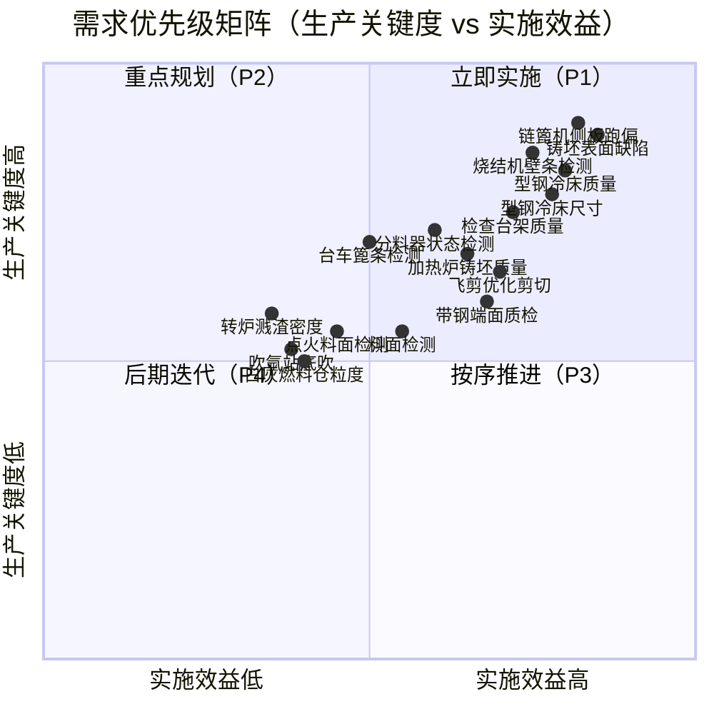

### 2.2 综合优先级排序表

| 优先级 | 序号 | 厂部 | 场景 | 生产关键度 | 实施效益 | 综合评分 | 实施阶段 |
|:---:|:---:|---|---|:---:|:---:|:---:|:---:|
| **P1** | 10 | 炼钢 | 铸坯表面缺陷识别 | ★★★★★ | ★★★★★ | 9.8 | 第一阶段 |
| **P1** | 1  | 球团 | 链篦机侧板跑偏检测 | ★★★★★ | ★★★★☆ | 9.5 | 第一阶段 |
| **P1** | 5  | 烧结 | 烧结机壁条脱落检测 | ★★★★★ | ★★★★☆ | 9.3 | 第一阶段 |
| **P1** | 12 | 型钢 | 冷床入口钢材质量 | ★★★★☆ | ★★★★★ | 9.2 | 第一阶段 |
| **P1** | 13 | 型钢 | 冷床入口钢材尺寸 | ★★★★☆ | ★★★★★ | 9.0 | 第一阶段 |
| **P2** | 14 | 型钢 | 检查台架钢材质量 | ★★★★☆ | ★★★★☆ | 8.5 | 第二阶段 |
| **P2** | 11 | 型钢 | 加热炉铸坯质量 | ★★★★☆ | ★★★★☆ | 8.3 | 第二阶段 |
| **P2** | 2  | 球团 | 分料器运行状态检测 | ★★★★☆ | ★★★☆☆ | 8.0 | 第二阶段 |
| **P2** | 7  | 烧结 | 台车篦条缺损检测 | ★★★★☆ | ★★★☆☆ | 7.8 | 第二阶段 |
| **P3** | 15 | 带钢 | 飞剪优化剪切 | ★★★☆☆ | ★★★★☆ | 7.5 | 第三阶段 |
| **P3** | 16 | 带钢 | 卷取端面质检 | ★★★☆☆ | ★★★★☆ | 7.2 | 第三阶段 |
| **P3** | 3  | 球团 | 成一皮带料面检测 | ★★★☆☆ | ★★★☆☆ | 7.0 | 第三阶段 |
| **P3** | 4  | 烧结 | 点火料面（点火强度） | ★★★☆☆ | ★★★☆☆ | 6.8 | 第三阶段 |
| **P4** | 8  | 炼钢 | 转炉溅渣渣粒密度 | ★★★☆☆ | ★★☆☆☆ | 6.0 | 第四阶段 |
| **P4** | 9  | 炼钢 | 吹氩站底吹处理 | ★★☆☆☆ | ★★☆☆☆ | 5.5 | 第四阶段 |
| **P4** | 6  | 烧结 | 白灰仓/燃料仓粒度 | ★★☆☆☆ | ★★☆☆☆ | 5.2 | 第四阶段 |

> **P1（立即实施）**：停机风险高或直接质量损失大；**P2（重点规划）**：减员提效明显；**P3（按序推进）**：技术可行但场景相对独立；**P4（后期迭代）**：技术难度大，先在算法实验室（Sandboxing）中研究攻关，不纳入主工期但平台预留接入位。

---

## 三、平台总体设计理念

### 3.1 核心设计原则

- **统一接入**：所有摄像头、边缘盒子通过标准协议注册，消除多厂商烟囱；
- **低代码驱动**：场景绑定、算法流程、路由规则全部通过可视化编排器配置，无需改代码；
- **算法原子化**：抽象通用检测/分割/分类基础组件，多场景共用主干，仅更换任务头；
- **弹性调度**：推理任务根据 GPU/CPU 资源动态分配，高峰不挤压、空闲不浪费；
- **训推分离**：训练集群与生产推理集群物理/逻辑隔离，训练不影响生产；
- **实验室先行**：P4 场景和新算法先在 Sandbox 环境静默验证，达标后灰度转正；
- **持续自愈**：感知端健康监控 + 模型漂移检测，异常自动触发维修工单和重训练任务；
- **安全隔离**：数据跨区传输必须经过安全网闸，生产网络与办公网络严格隔离；
- **开放集成**：标准 API/消息总线对接现有工业互联网平台，不重复建设。

### 3.2 平台整体逻辑架构

```mermaid
graph TB
    subgraph 数据采集层
        C1[球团厂摄像头群]
        C2[烧结厂摄像头群]
        C3[炼钢厂摄像头群]
        C4[型钢厂摄像头群]
        C5[带钢厂摄像头群]
        EDGE[边缘计算节点]
        HEALTH[感知健康监控]
    end

    subgraph 低代码编排层
        DESIGNER[视觉逻辑编排器]
        CALI[在线标定工具]
        PLUGIN[算法插件注册中心]
        CONFIG[后台配置中心 Nacos]
    end

    subgraph 原子算法仓
        ATOM1[通用目标检测引擎]
        ATOM2[通用分割引擎]
        ATOM3[通用分类器]
        ATOM4[测量与标定组件]
        ATOM5[去雾/增强预处理组件]
    end

    subgraph 接入与路由层
        GATEWAY[视觉接入网关\nT型分流]
        ROUTER[场景路由引擎]
    end

    subgraph 推理服务层
        INF1[质量检测推理服务]
        INF2[设备监测推理服务]
        INF3[工艺参数推理服务]
        SANDBOX[算法实验室\nSandbox推理]
        SCHED[推理任务调度器]
        GPU_POOL[GPU 推理资源池]
        DRIFT[模型漂移监测]
    end

    subgraph 训练平台（资源隔离）
        ANNO[数据标注平台]
        TRAIN_JOB[模型训练作业]
        TRAIN_GPU[训练 GPU 集群]
        MODEL_REG[模型注册仓库 MLflow]
        GAP[安全网闸 Data Gap]
    end

    subgraph 结果处理层
        RESULT_BUS[结果消息总线 Kafka]
        ALARM[报警引擎\n含Sandbox拦截器]
        STORE[结果存储 / 历史库]
        COMPARE[生产/实验室对比看板]
    end

    subgraph 对外集成层
        IIoT[工业互联网平台]
        MES[MES 系统]
        SCADA[SCADA / DCS]
        APP[移动端 APP]
    end

    C1 & C2 & C3 & C4 & C5 --> EDGE
    EDGE --> HEALTH
    EDGE --> GATEWAY
    DESIGNER --> CONFIG --> ROUTER
    CALI & PLUGIN --> DESIGNER
    GATEWAY -->|主路由| ROUTER
    GATEWAY -->|镜像流| SANDBOX
    ROUTER --> INF1 & INF2 & INF3
    ATOM1 & ATOM2 & ATOM3 & ATOM4 & ATOM5 --> INF1 & INF2 & INF3 & SANDBOX
    INF1 & INF2 & INF3 --> SCHED --> GPU_POOL
    GPU_POOL --> RESULT_BUS
    SANDBOX --> ALARM
    RESULT_BUS --> ALARM & STORE
    ALARM --> IIoT & APP
    STORE --> MES & SCADA & COMPARE
    DRIFT --> MODEL_REG
    MODEL_REG --> INF1 & INF2 & INF3
    TRAIN_JOB --> MODEL_REG
    TRAIN_GPU --> TRAIN_JOB
    ANNO --> TRAIN_JOB
    STORE -->|脱敏同步| GAP --> ANNO
    HEALTH -->|硬件告警工单| IIoT
```

---

## 四、技术架构

### 4.1 技术选型总览

| 层次 | 组件 | 选型 | 说明 |
|---|---|---|---|
| 视频接入 | 流媒体协议 | RTSP / GB28181 | 兼容主流工业摄像头 |
| 边缘计算 | 边缘推理 | NVIDIA Jetson / 海思 3559 | 高温、粉尘环境适配 |
| **低代码引擎** | **可视化编排** | **Node-RED（私有化）/ 自研图形化组件** | **流程节点拖拽，非AI人员可配置算法逻辑** |
| 消息总线 | 流处理 | Apache Kafka | 高吞吐、持久化，支持 T 型分流镜像 |
| 推理框架 | 深度学习推理 | TensorRT + ONNX Runtime | 最优 GPU 利用率 |
| **原子算法仓** | **组件化推理** | **自研 SDK + 标准 Container 接口** | **Image In → JSON Out 标准插件协议** |
| 容器调度 | 微服务编排 | Kubernetes + GPU Operator | 弹性扩缩容，Sandbox 命名空间隔离 |
| 训练框架 | 模型训练 | PyTorch 2.x + MMDetection | 工业检测主流生态 |
| 数据标注 | 标注平台 | Label Studio（私有化部署） | 支持图像/视频标注 |
| 模型管理 | MLOps | MLflow + Harbor | 版本管理 + 镜像仓库 |
| **数据安全** | **安全网闸** | **工业单向光闸（物理隔离）** | **生产→训练数据单向流转，防反向渗透** |
| 配置中心 | 动态配置 | Nacos | 热更新、无重启发布 |
| 后台管理 | Web 框架 | Vue3 + Spring Boot | 前后端分离 |
| 数据库 | 结构化数据 | PostgreSQL | 配置、元数据存储 |
| 时序数据 | 推理结果 | InfluxDB / TDengine | 高频时序写入 |
| 对象存储 | 图像/视频 | MinIO（私有化 S3） | 原始图像留存 |
| **健康监控** | **感知端监控** | **自研图像质量检测服务（拉普拉斯方差）** | **实时检测模糊/黑屏/遮挡** |
| **漂移监测** | **模型精度监控** | **自研准确率曲线服务** | **AI报警数 vs 人工复核数，自动触发重训练** |
| 报警推送 | 消息推送 | MQTT + WebSocket | 工业互联网标准协议 |

### 4.2 微服务模块划分（V2.0 增补）

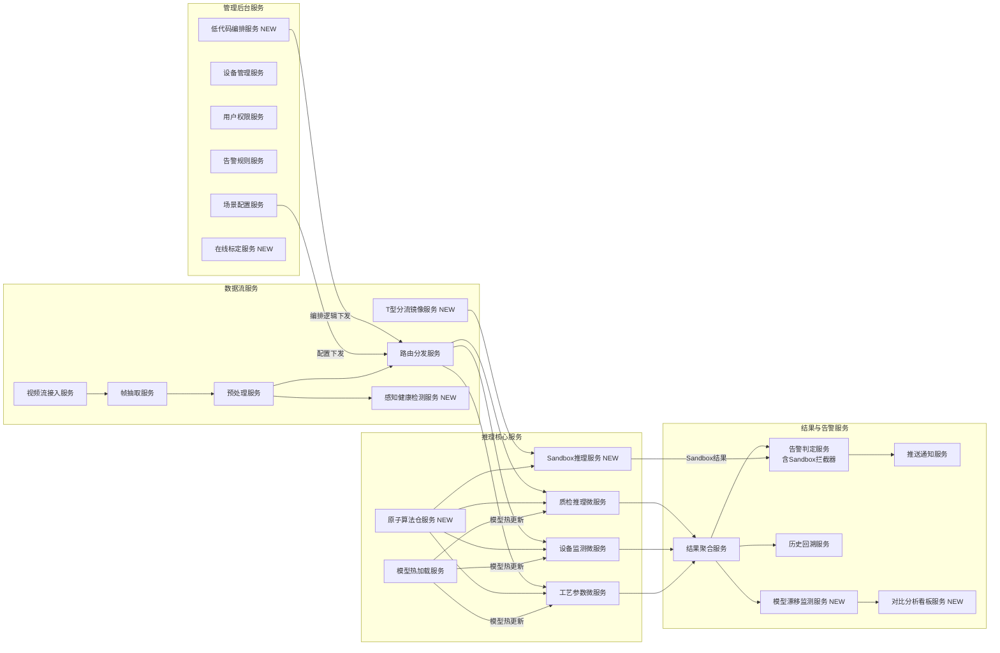

### 4.3 推理任务调度机制

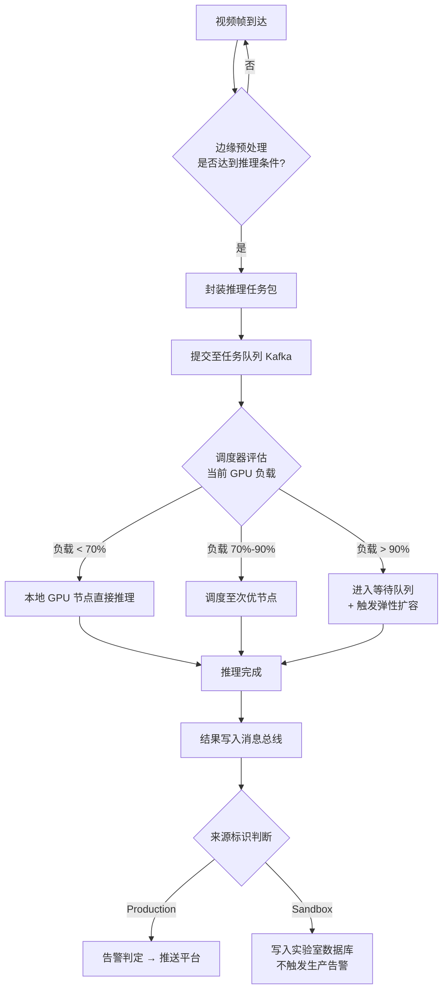

---

## 五、主要功能模块

### 5.1 场景管理与后台配置

- **场景注册**：通过 Web 界面完成摄像头 + 算法流水线 + 阈值的绑定，支持批量导入；
- **可视化 ROI 配置**：支持通过鼠标在视频画面上直接绘制感兴趣区域（检测框、计数线、测量区），所见即所得，无需手工填写坐标；
- **场景分组**：按厂部 / 工序 / 类型（质量检测 / 设备监测 / 工艺参数）分层管理；
- **热生效**：配置变更后无需重启推理服务，毫秒级热加载；
- **版本回滚**：场景配置保留历史版本，支持一键回滚。

### 5.2 统一推理引擎（算法组件化）

- 支持 **YOLOv8 / YOLOv9 / RT-DETR** 目标检测；
- 支持 **分割模型（SAM 适配）** 用于尺寸测量；
- 支持 **分类模型** 用于状态判别（分料器开 / 关，壁条正常 / 异常）；
- 支持**多模型串联**（先检测再分类的两阶段流水线）；
- **算法组件化**：通过"特征主干网共享"技术，多个相似场景（如型钢质量检测、铸坯质量检测）共用一个基础特征提取器（Backbone），仅更换任务头（Task Head），大幅降低部署资源消耗与维护成本；
- **标准插件协议**：所有算法（自研或第三方）必须符合 `Image In → JSON Out` 的标准输入输出接口，即插即用，无需修改平台代码；
- 推理延迟目标：单帧 **< 50ms**（边缘）/ **< 20ms**（服务器 GPU）。

### 5.3 模型训练平台

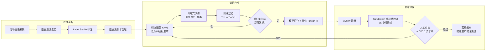

> **新增**：模型在发布为生产版本前，必须先进入 **Sandbox 环境** 完成静默验证（见第八章），达到精度门槛且连续 N 小时稳定后，方可提交人工审核。

### 5.4 报警引擎

- **多级报警**：信息级（INFO）/ 预警级（WARNING）/ 严重级（CRITICAL）三级体系；
- **防误报策略**：连续 N 帧确认（可配）+ 时间窗口内频次过滤，避免单帧噪声误触发；
- **报警归并**：同一设备同类告警在设定时窗内只推送一次，避免告警风暴；
- **Sandbox 报警拦截器**：来自实验室推理服务的告警结果，仅写入实验室数据库，绝不触发 MQTT 推送，保证生产系统不受新算法干扰；
- **推送通道**：MQTT → 工业互联网平台、WebSocket → Web/移动端、短信 / 企业微信（可选）。

### 5.5 可视化与数据看板

- **实时监控大屏**：各厂部摄像头分组展示，异常高亮标注；
- **生产/实验室叠加对比**：同一画面同时展示生产模型（实线检测框）和实验室模型（虚线检测框），直观对比两套算法的检测差异；
- **推理结果回放**：历史图像 + 标注框时间轴回溯，支持按场景 / 时间 / 异常类型筛选；
- **统计分析**：缺陷率趋势、设备告警频次、推理性能（吞吐量、延迟分布）；
- **模型管理面板**：各场景当前生产模型版本、精度指标、漂移曲线、上次训练时间；
- **感知端健康看板**：各摄像头在线状态、图像质量评分、历史故障记录。

---

## 六、低代码视觉逻辑编排平台

### 6.1 设计理念

传统方案中，"摄像头 + 算法 + 阈值"是静态绑定，修改任何一个环节都需要改代码、重部署。本平台引入**视觉逻辑编排器（Visual Workflow Designer）**，将算法处理流程抽象为可视化的"流程节点"，通过拖拽即可完成完整的推理逻辑配置。非 AI 专业人员（如工艺工程师、设备主管）也能在不改代码的前提下，完成业务逻辑的调整与优化。

### 6.2 编排器架构

```mermaid
flowchart LR
    subgraph 节点类型库
        N1[📹 视频源节点]
        N2[🔧 预处理节点\n去雾/增强/裁剪]
        N3[🔍 算法节点\n来自原子算法仓]
        N4[📐 逻辑判断节点\n阈值/比较/计数]
        N5[📏 测量标定节点]
        N6[🔔 告警推送节点]
        N7[💾 存储节点]
    end

    subgraph 编排画布示例：链篦机侧板跑偏
        E1[视频源\n链篦机相机] --> E2[预处理\n去振动抖动]
        E2 --> E3[原子检测\n侧板位置识别]
        E3 --> E4[测量标定\n偏移量计算mm]
        E4 --> E5{逻辑判断\n偏移量 > 10mm?}
        E5 -->|是| E6[告警推送\nCRITICAL级]
        E5 -->|否| E7[存储\n写入历史库]
    end
```

### 6.3 在线标定工具

传统的像素到毫米转换（如链篦机侧板 10mm 精度要求）通常需要硬编码。本平台提供 **UI 驱动的在线标定工具**，实现零代码完成比例尺标定：

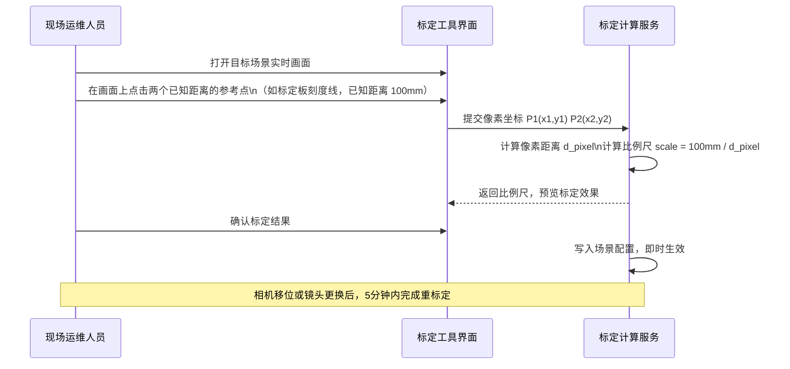

### 6.4 低代码平台功能对比

| 功能维度 | 传统开发模式 | 低代码编排模式 | 改善效果 |
|---|---|---|---|
| 新场景上线 | 开发+测试+部署，约 2 周 | 拖拽配置+标定，约 2 天 | **效率提升约 80%** |
| 阈值调整 | 改代码 → 重部署 → 验证 | 界面直接修改，秒级生效 | **零停机调整** |
| 算法替换 | 重写适配代码 | 替换算法节点，符合标准接口即可 | **解耦，无侵入** |
| ROI 区域调整 | 手工填写像素坐标 | 画面上鼠标绘制 | **所见即所得** |
| 比例尺标定 | 硬编码写死 | 在线标定工具，5分钟完成 | **免代码，可重复** |

---

## 七、算法复用：原子化算法仓

### 7.1 为什么需要算法原子化

16 个场景如果各自独立开发算法，将形成 16 套互不关联的代码库，带来维护成本高、算力浪费、技术债务堆积等问题。通过对场景的抽象分析，可以发现大量场景的底层视觉任务高度相似，应该构建"原子算法 + 行业任务头"的两层架构。

### 7.2 原子算法与场景的对应关系

```mermaid
graph TB
    subgraph 原子算法层（共享主干网络）
        A1[通用目标检测引擎\nYOLO/RT-DETR Backbone]
        A2[通用语义分割引擎\nSAM/SegFormer Backbone]
        A3[通用图像分类器\nResNet/EfficientNet]
        A4[测量与标定组件\n亚像素精度]
        A5[图像增强组件\n去雾/去光晕/降噪]
    end

    subgraph 场景任务头层（轻量微调）
        T1[篦条缺损检测头]
        T2[侧板偏移检测头]
        T3[钢材表面缺陷头]
        T4[铸坯裂纹检测头]
        T5[料面高度估计头]
        T6[分料器状态分类头]
        T7[渣粒密度估计头]
        T8[尺寸测量回归头]
    end

    subgraph 场景应用（16个）
        S1[链篦机侧板跑偏]
        S2[烧结机壁条检测]
        S3[台车篦条检测]
        S4[铸坯表面缺陷]
        S5[型钢冷床质量]
        S6[型钢冷床尺寸]
        S7[成一皮带料面]
        S8[分料器状态]
        S9[转炉溅渣密度]
        S10[其他场景...]
    end

    A1 --> T1 & T2 & T3 & T4
    A2 --> T5 & T7 & T8
    A3 --> T6
    A4 --> T2 & T8
    A5 --> T4 & T7

    T1 --> S2 & S3
    T2 --> S1
    T3 --> S5
    T4 --> S4
    T5 --> S7
    T6 --> S8
    T7 --> S9
    T8 --> S6
```

### 7.3 算法插件化标准接口

所有接入平台的算法（无论自研还是第三方采购），必须封装为符合以下标准的 Container 插件：

```json
// 标准算法插件接口定义
{
  "plugin_meta": {
    "plugin_id": "ATOM-DETECT-YOLO-V1",
    "name": "通用目标检测引擎",
    "version": "1.2.0",
    "input_format": "BGR Image Array [H, W, 3]",
    "output_format": "JSON"
  },
  "input": {
    "image": "<base64_or_tensor>",
    "roi": {"x": 0, "y": 0, "w": 1920, "h": 1080},
    "params": {"conf_threshold": 0.85, "iou_threshold": 0.45}
  },
  "output": {
    "detections": [
      {
        "class_id": 0,
        "class_name": "defect_crack",
        "confidence": 0.92,
        "bbox": {"x1": 120, "y1": 200, "x2": 180, "y2": 260},
        "measurement": {"value": 12.5, "unit": "mm"}
      }
    ],
    "inference_time_ms": 18,
    "timestamp": "2026-04-15T08:23:11.456Z"
  }
}
```

---

## 八、算法实验室（Sandboxing）

算法实验室是本平台的核心创新模块之一，解决了工业 AI 系统"新算法上线风险高"的核心痛点。其本质是在**不触动生产指令集（PLC/DCS）的前提下**，让新算法在真实生产环境的镜像流中进行"带薪试训"。

### 8.1 整体架构

```mermaid
graph TB
    subgraph 视频接入层
        CAM[现场摄像头]
        GW[视觉接入网关]
        CAM --> GW
        GW -->|主路流量| PROD_KAFKA[生产 Kafka Topic]
        GW -->|镜像流量\n5fps 抽样| SB_KAFKA[实验室 Kafka Topic]
    end

    subgraph 生产推理（Production）
        PROD_KAFKA --> PROD_INF[生产推理服务\n正式模型 V1.x]
        PROD_INF --> PROD_RESULT[生产结果]
        PROD_RESULT --> ALARM[报警引擎\n触发工单/MQTT]
    end

    subgraph 实验室推理（Sandbox）
        SB_KAFKA --> SB_INF[实验室推理服务\n候选模型 V2.0-beta]
        SB_INF --> SB_RESULT[实验室结果]
        SB_RESULT --> INTERCEPTOR[报警拦截器\n仅写实验室DB\n不触发任何生产告警]
    end

    subgraph 评价与晋升
        PROD_RESULT & SB_RESULT --> COMPARE[一致性对比分析]
        COMPARE --> SCORE[精度评分\n潜在收益统计]
        SCORE --> CANARY{连续N小时\n实验室模型优于生产?}
        CANARY -->|是| PROMOTE[灰度转正\n蓝绿发布至生产]
        CANARY -->|否| SB_INF
    end
```

### 8.2 数据流层：T型分流（Traffic Mirroring）

- **主路流量**：生产推理服务订阅全帧率（如 25fps）流，保证生产不受影响；
- **镜像流量**：实验室服务订阅降频镜像流（如 5fps），降低实验室环境网络与计算负载；
- **Kafka 多消费组**：利用已有消息总线，生产服务与实验室服务分属不同 Consumer Group，订阅同一 Topic 的图像帧数据，互不干扰。

### 8.3 计算层：Sandbox 资源隔离

| 维度 | 生产 Pod（Production）| 实验室 Pod（Sandbox）|
|---|---|---|
| **K8s 命名空间** | `production` | `sandbox` |
| **GPU 资源配额** | 优先级高，不可抢占 | 严格限额，不得抢占生产资源 |
| **报警推送权限** | 完整（MQTT/工单/短信）| **禁止**（仅写实验室数据库）|
| **模型来源** | 经审核的正式版本 | 待验证的候选版本 |
| **故障隔离** | 独立进程，互不影响 | 实验室 Pod 崩溃不影响生产 |

### 8.4 逻辑层：静默评估与报警仿真

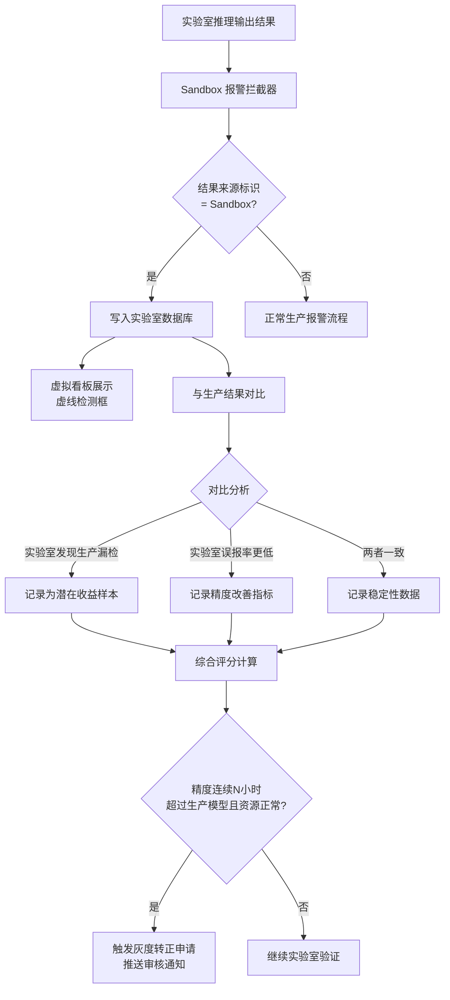

### 8.5 P4 场景实验室验证策略

对于技术难度较大的 P4 场景（吹氩站底吹、转炉溅渣密度、白灰燃料仓粒度），建议采用"实验室先行"策略：

| P4 场景 | 实验室验证重点 | 预计验证周期 | 转正条件 |
|---|---|---|---|
| 吹氩站底吹识别 | 去雾算法（DCP）在不同烟气浓度下的召回率 | 4-6 周 | 轻度烟气 mAP > 80% |
| 转炉溅渣密度 | 渣粒密度量化与人工判断的一致性 | 3-4 周 | 与人工判断一致率 > 85% |
| 白灰/燃料仓粒度 | 粒度分级精度，标定误差 | 4-6 周 | 粒度分级准确率 > 90% |

---

## 九、场景接入与路由机制

### 9.1 场景接入流程

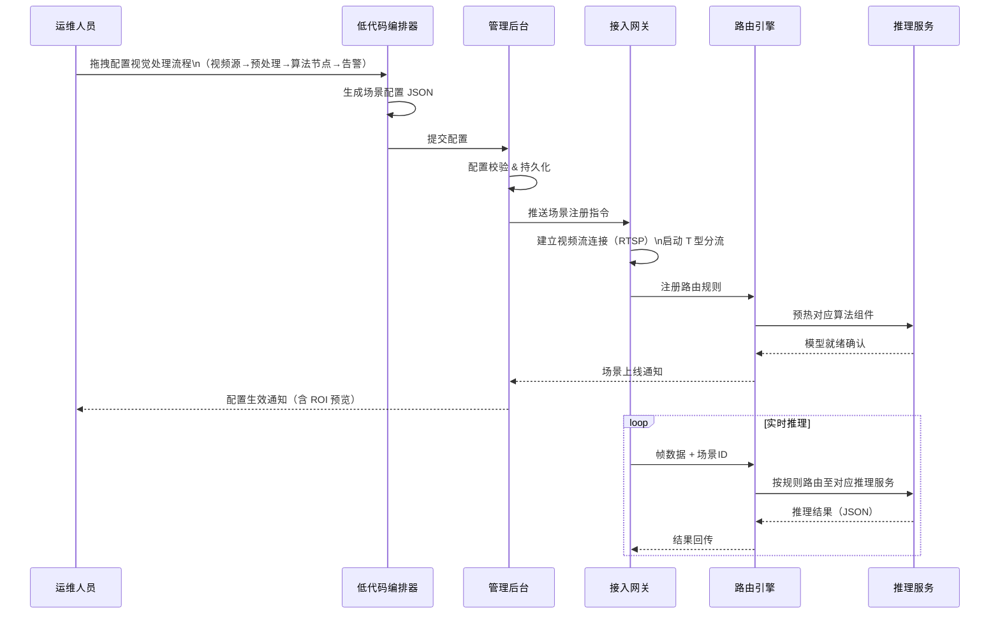

### 9.2 场景分类路由规则

| 场景类型 | 路由至推理服务 | 推理模型类别 | 优先队列 |
|---|---|---|:---:|
| 质量检测类（4个场景） | 质检推理服务 | 缺陷检测 / 尺寸测量 | 高 |
| 设备状态监测类（4个场景） | 设备监测推理服务 | 目标检测 / 状态分类 | 高 |
| 工艺参数检测类（8个场景） | 工艺参数推理服务 | 密度估计 / 区域分析 | 中 |
| P4 / 实验室场景 | Sandbox 推理服务 | 候选模型（隔离推理） | 低（不抢占） |

---

## 十、训练平台与生产平台资源隔离

### 10.1 资源隔离架构（含安全网闸）

```mermaid
graph TB
    subgraph 生产环境（Production Zone）
        PG[生产推理 GPU 集群\nA100×4 / RTX4090×8]
        PK[生产 K8s 命名空间\nproduction]
        PDB[生产数据库\nPostgreSQL-prod]
        PNET[生产网络 独立 VLAN]
        SB_POD[Sandbox K8s 命名空间\nsandbox]
        PG --- PK --- PDB --- PNET
        SB_POD --- PNET
    end

    subgraph 安全隔离区
        GAP[工业单向光闸\nData Gap\n物理单向传输]
        DEDUP[图像脱敏服务\n去除敏感标识/水印]
        AUDIT[传输审计日志]
        GAP --- DEDUP --- AUDIT
    end

    subgraph 训练环境（Training Zone）
        TG[训练 GPU 集群\nA100×8 可弹性扩展]
        TK[训练 K8s 命名空间\ntraining]
        TDB[训练数据仓库\nMinIO + PostgreSQL-train]
        TNET[训练网络 独立 VLAN]
        TG --- TK --- TDB --- TNET
    end

    subgraph 共享服务层（Shared Services）
        MR[模型注册仓库\nMLflow + Harbor]
        SC[配置中心 Nacos]
        MON[统一监控\nPrometheus + Grafana]
    end

    PNET -->|每日凌晨\n单向推送原始图像| GAP
    GAP -->|脱敏后数据\n只可写入训练区| TNET
    TNET -.->|严禁反向访问生产网| PNET
    TNET -->|模型推送经审核| MR
    MR -->|生产侧拉取正式模型| PK
    SC --> PK & TK & SB_POD
    MON --> PG & TG
```

**安全隔离要点（V2.0 新增）：**

1. **物理单向光闸**：生产网络到训练网络之间部署单向光闸，从根本上保证训练侧无法访问生产网络，防止训练代码或工具对生产系统造成意外影响；
2. **数据脱敏审计**：所有从生产环境同步至训练环境的图像数据，必须经过脱敏服务（去除摄像头标识、生产批次等敏感信息），并记录完整传输审计日志；
3. **训练侧不直连生产**：训练环境不开通对生产数据库的任何访问权限，数据以文件形式单向流转；
4. **模型审核流水线**：从训练环境到生产推理集群的模型发布，必须经过 Sandbox 验证 + 人工审核 + CI/CD 流水线，禁止手动推送；
5. **K8s 资源配额**：生产命名空间资源配额优先保障，Sandbox 和训练命名空间设置严格上限，防止抢占生产算力。

---

## 十一、报警与工业互联网对接

### 11.1 报警流转链路

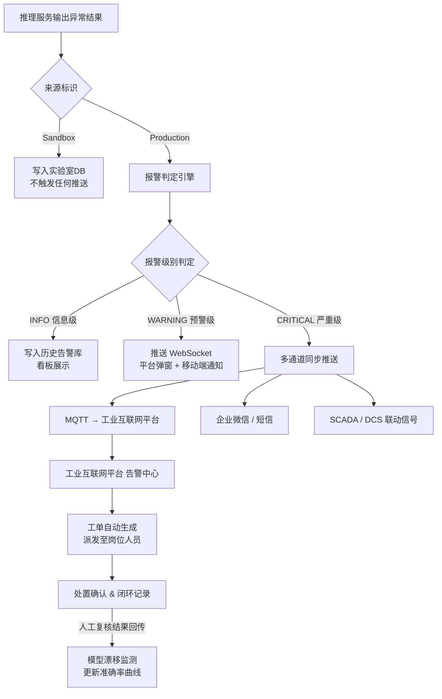

### 11.2 与工业互联网平台集成接口规范

| 接口方向 | 协议 | 数据格式 | 说明 |
|---|---|---|---|
| AI平台 → 工业互联网 | MQTT QoS 1 | JSON | 告警事件上报，含场景ID、异常类型、置信度、图像URL |
| AI平台 → 工业互联网 | REST API | JSON | 批量历史数据同步（每分钟） |
| 工业互联网 → AI平台 | REST API | JSON | 处置结果回写，用于模型漂移监测闭环 |
| AI平台 → SCADA | OPC-UA | 标准数据类型 | 关键报警联动设备停机指令（可选） |
| 感知监控 → 工业互联网 | MQTT QoS 1 | JSON | 硬件故障工单上报（相机模糊/黑屏/过热） |

---

## 十二、感知端健康监控与模型漂移监测

> **V2.0 新增核心模块**。本章解决平台"上线后持续高质量运行"的核心问题。

### 12.1 感知端健康监控（Hardware Health Monitoring）

钢铁厂的高温、高粉尘环境会导致相机镜头模糊、偏位、过热甚至黑屏，使推理结果悄无声息地失效。平台通过图像质量算法，对每路视频流进行**无感知的持续健康检测**。

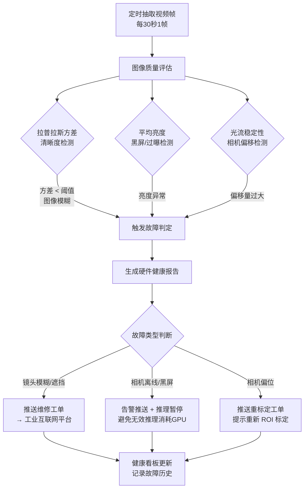

**技术实现：**
- **模糊检测**：计算帧图像拉普拉斯算子的方差，值越小表示越模糊，低于阈值即判定异常；
- **黑屏检测**：统计帧平均灰度值，接近 0 判定黑屏；
- **偏移检测**：利用光流法计算相邻帧的整体运动向量，超出正常振动范围判定为相机偏位；
- **补光失效检测**（针对烧结机壁条等需要补光的场景）：对比有补光时的基准亮度，检测补光灯是否故障。

### 12.2 模型漂移监测（Model Drift Monitoring）

工业算法并非"一劳永逸"。环境光照随季节变化、生产线设备老化、原料品种更换，都会导致模型精度悄然下滑。本模块通过建立**闭环评价机制**，实现模型精度的自动监控与触发式重训练。

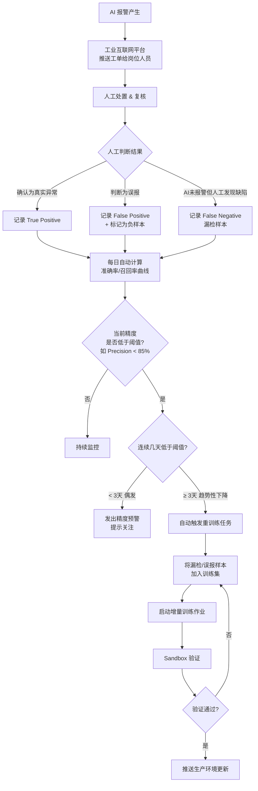

---

## 十三、实施工期计划

> 项目启动时间：**2026 年 4 月初**，目标完成节点：**2026 年 5 月底**

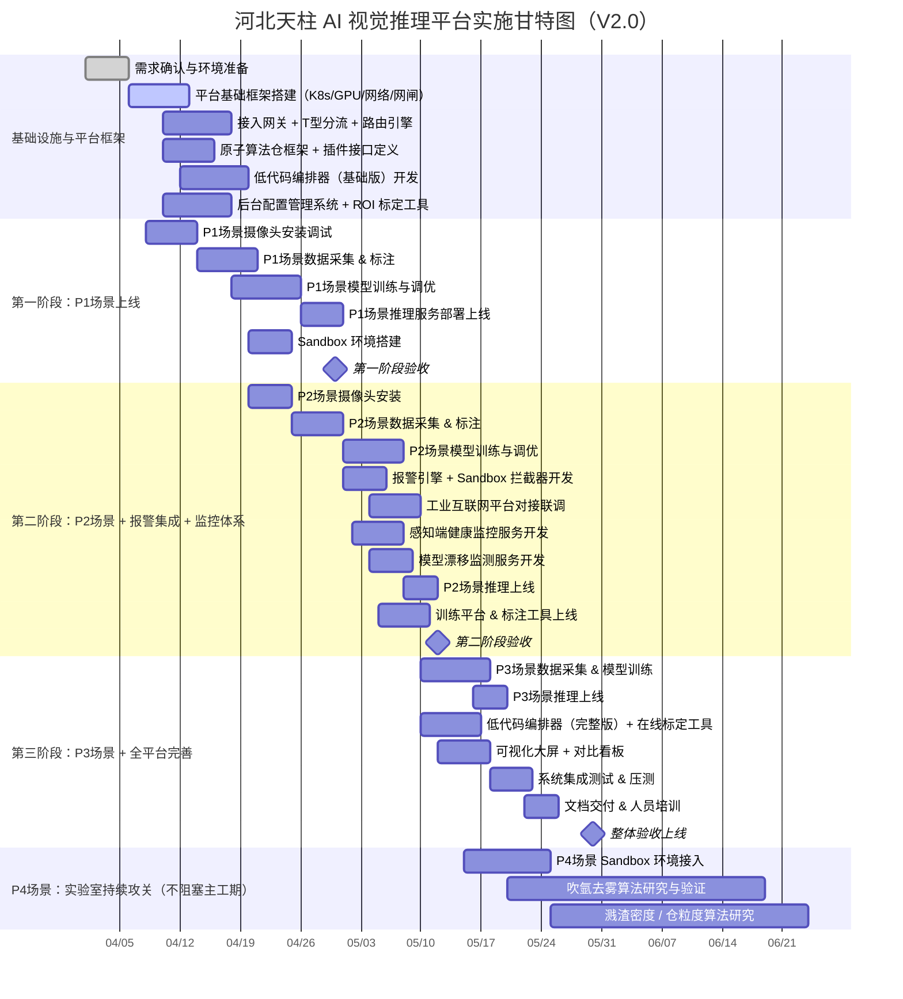

### 里程碑说明

| 里程碑 | 时间 | 核心交付内容 |
|---|---|---|
| M1 第一阶段验收 | 4月30日 | 平台框架 + 低代码编排器基础版 + P1场景（5个）+ Sandbox环境上线 |
| M2 第二阶段验收 | 5月12日 | P2场景（4个）+ 报警与IIoT对接 + 感知健康监控 + 漂移监测 + 训练平台 |
| M3 整体验收 | 5月30日 | P3场景（5个）+ 低代码完整版 + 全平台可视化 + 文档培训齐全 |

---

## 十四、技术难度评定

### 14.1 各场景技术难度评估

| 序号 | 场景 | 难度等级 | 主要难点 |
|:---:|---|:---:|---|
| 1 | 链篦机侧板跑偏 | ⭐⭐⭐ | 10mm 高精度，振动干扰，需亚像素精度 + 在线标定 |
| 2 | 分料器运行状态 | ⭐⭐ | 状态分类，技术成熟，可直接复用通用分类器 |
| 3 | 成一皮带料面检测 | ⭐⭐ | 料面高度估计，光照变化，可复用分割引擎 |
| 4 | 点火料面/点火强度 | ⭐⭐⭐ | 高温强光，火焰图像处理，需专用去光晕预处理 |
| 5 | 烧结机壁条检测 | ⭐⭐⭐ | 光照有限需补光，细小目标，粉尘干扰 |
| 6 | 白灰/燃料仓粒度 | ⭐⭐⭐⭐ | 粒度测量细粒度任务，标定精度高，建议P4实验室先行 |
| 7 | 台车篦条检测 | ⭐⭐⭐ | 135部台车，连续运动，可复用目标检测原子组件 |
| 8 | 转炉溅渣密度 | ⭐⭐⭐⭐ | 渣粒密度量化困难，高温极端光照，P4实验室验证 |
| 9 | 吹氩站底吹 | ⭐⭐⭐⭐⭐ | 烟气严重遮挡，DCP去雾算法在强烟环境下效果存疑，P4 |
| 10 | 铸坯表面缺陷 | ⭐⭐⭐ | 缺陷类型多，数据量充足，可复用缺陷检测原子组件 |
| 11 | 加热炉铸坯质量 | ⭐⭐⭐ | 氧化铁干扰，高温辐射，可复用场景10的主干网络 |
| 12 | 冷床钢材质量 | ⭐⭐⭐ | 型钢结构复杂，多角度相机，可复用场景10/11主干 |
| 13 | 冷床钢材尺寸 | ⭐⭐⭐⭐ | 线结构光/双目三维测量，标定精度高，需在线标定工具 |
| 14 | 检查台架钢材质量 | ⭐⭐⭐ | 成品检测，误报率要求低，可复用场景12的模型 |
| 15 | 飞剪优化剪切 | ⭐⭐⭐ | 与控制系统闭环，实时性 < 10ms，边缘端部署 |
| 16 | 带钢端面质检 | ⭐⭐ | 缺陷类型固定，图像清晰，可复用通用分类器 |

### 14.2 平台级技术难点（V2.0 新增）

| 难点 | 描述 | 应对方案 |
|---|---|---|
| 多场景统一调度 | 16个并发场景同时推理，GPU 资源动态分配 | 优先级抢占式调度 + 弹性扩容 |
| 工业环境适应 | 高温、粉尘、强光、振动对相机和算法的影响 | 工业级相机 + 感知健康监控自动预警 |
| 低延迟要求 | 飞剪场景要求推理-控制闭环 < 10ms | 边缘端专用推理模块，TensorRT 量化 |
| 训推分离同步 | 模型更新不中断生产推理 | 蓝绿发布 + 模型热加载 + Sandbox 预验证 |
| **业务逻辑与算法解耦** | 工艺工程师需调整检测规则但不懂代码 | **低代码编排器 + 插件化算法接口** |
| **模型长期精度保障** | 环境变化导致精度悄然下滑 | **漂移监测 + 人工复核闭环 + 自动触发重训练** |
| **感知端静默失效** | 相机故障但系统仍"正常"推理空白帧 | **图像质量健康检测服务，异常帧推理熔断** |
| **新算法上线风险** | 直接替换生产模型风险高 | **Sandbox 静默验证 + 灰度转正机制** |

---

## 十五、风险评估与对策

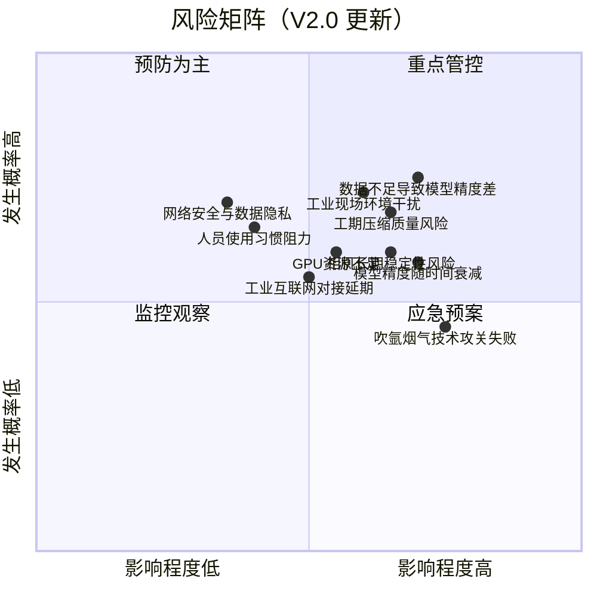

### 风险详细清单与应对措施

| 风险编号 | 风险描述 | 概率 | 影响 | 应对措施 |
|---|---|:---:|:---:|---|
| R01 | 现场数据量不足，模型精度达不到要求 | 高 | 高 | 提前并行采集数据；数据增强+迁移学习；设精度验收红线 |
| R02 | 7周工期偏紧，P3场景可能延期 | 中高 | 中 | P3滚动上线；P1/P2严格管控关键路径；提前4周采购硬件 |
| R03 | 工业现场粉尘/高温/光照干扰导致相机故障 | 中高 | 高 | IP67工业相机+防护箱体；感知健康监控自动预警；定期维护 |
| R04 | 吹氩站烟气遮挡，技术方案未验证 | 高 | 中 | 纳入P4实验室先行；调研DCP去雾+激光雷达辅助；不影响主工期 |
| R05 | 工业互联网平台接口协议不明确 | 中 | 中 | 提前2周启动接口协议讨论；预留Mock接口自测 |
| R06 | GPU 资源采购周期长 | 低 | 高 | 提前4周采购；备选CPU推理过渡方案 |
| R07 | 岗位人员对 AI 系统信任度不足 | 中 | 中 | 上线初期"建议模式"；效果公示机制；低代码工具降低使用门槛 |
| R08 | 生产网络安全风险 | 低 | 高 | 单向光闸隔离；工业防火墙；数据传输加密 |
| **R09** | **模型精度随时间衰减，无人发现** | **高** | **高** | **漂移监测服务 + 人工复核闭环；准确率低于阈值自动触发重训练** |
| **R10** | **相机模糊/偏位导致推理静默失效** | **中高** | **高** | **感知健康监控定时检测；异常推理熔断；自动推送维修工单** |
| **R11** | **低代码编排器配置错误导致推理逻辑异常** | **中** | **中** | **配置变更灰度发布；历史版本回滚；生产变更需经审核** |

---

## 十六、投资收益分析

### 16.1 投资估算（含 V2.0 新增模块）

| 类别 | 细项 | 估算金额（万元） |
|---|---|:---:|
| **硬件投入** | GPU 推理服务器（生产）×2台 | 60 |
| | GPU 训练+Sandbox服务器×1台 | 50 |
| | 工业相机 + 镜头 + 补光灯（16套） | 32 |
| | 边缘计算节点（6台） | 18 |
| | 网络交换机 + 防火墙 + **工业单向光闸** | 18 |
| **软件开发** | 平台软件开发（本期16场景）| 80 |
| | **低代码编排器 + 在线标定工具** | **15** |
| | **感知健康监控 + 模型漂移监测服务** | **10** |
| | **Sandbox 算法实验室** | **8** |
| | 标注工具私有化部署 | 5 |
| **实施费用** | 现场安装调试 | 15 |
| | 培训与文档 | 5 |
| **预备金** | 不可预见费（10%） | 31.6 |
| **合计** | | **347.6** |

### 16.2 效益测算（含低代码效益）

| 效益类型 | 计算依据 | 年化效益（万元） |
|---|---|:---:|
| **减少停机损失** | 链篦机停机 2次/年×15万/次，感知监控提前预防 | 30 |
| **质量损失降低** | 铸坯/型钢缺陷漏检率降低 60%，减少质量赔付/降级 | 80 |
| **成材率提升** | 飞剪优化剪切，成材率提升约 0.2%×50万吨 | 60 |
| **减员提效** | 可替代或辅助岗位约 8 人×6 万/人·年 | 48 |
| **能耗优化** | 点火强度优化、溅渣优化，估算节约 | 20 |
| **开发效率提升** | 低代码降低后期维护成本约 40%，新场景上线缩短 80%，折算年均节省工程人力约 2 人 | 12 |
| **模型失效损失避免** | 漂移监测及时发现精度衰减，避免因误报/漏检造成的质量损失扩大 | 15 |
| **年化总效益** | | **265** |

### 16.3 投资回收期

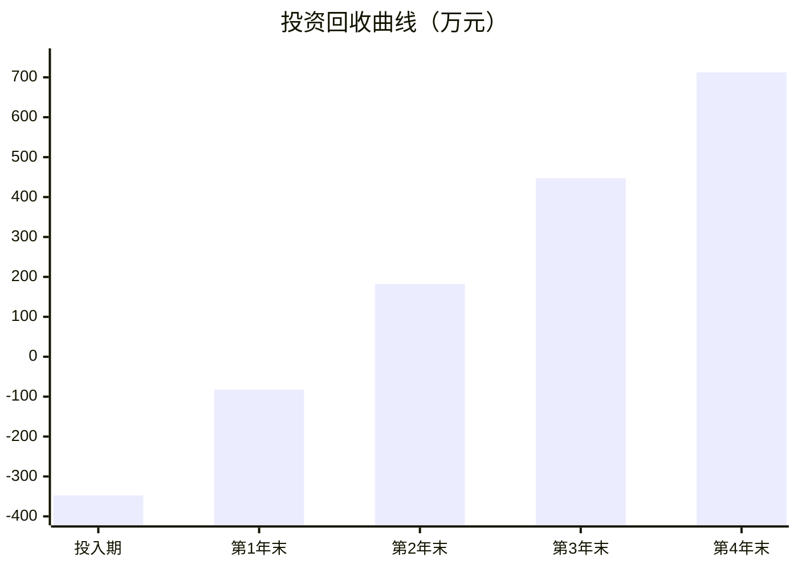

| 指标 | 数值 |
|---|---|
| 总投资 | 347.6 万元 |
| 年化净效益 | 265 万元 |
| **静态投资回收期** | **约 1.3 年** |
| 3年 ROI | 约 131% |
| 5年 NPV（折现率 8%） | 约 706 万元 |

---

## 十七、项目组织与交付物

### 17.1 建议项目团队组成

| 角色 | 人数 | 职责 |
|---|:---:|---|
| 项目经理 | 1 | 整体进度、风险、协调 |
| AI 算法工程师 | 3 | 模型训练、调优、精度验证、原子算法仓建设 |
| 后端开发工程师 | 2 | 平台微服务、调度、接口、漂移监测服务开发 |
| **低代码平台工程师** | **1** | **编排器、在线标定工具、插件接口开发** |
| 前端开发工程师 | 1 | 管理后台、大屏可视化、对比看板 |
| 数据标注工程师 | 2 | 现场数据采集与标注 |
| 硬件实施工程师 | 2 | 相机安装、网络布线、边缘节点、光闸部署 |
| 系统集成工程师 | 1 | 工业互联网平台对接、SCADA/OPC-UA |

### 17.2 主要交付物清单

| 阶段 | 交付物 |
|---|---|
| 需求阶段 | 场景需求规格说明书、摄像头点位布置图、算法原子化分析报告 |
| 设计阶段 | 技术架构设计文档、低代码编排器设计规范、算法插件接口协议、数据安全方案、API 接口规范 |
| 开发阶段 | 平台源代码、模型文件、低代码编排器、原子算法仓、部署脚本 |
| 测试阶段 | 测试报告（功能/性能/压力）、模型精度验证报告、Sandbox 验证报告 |
| 上线阶段 | 运维手册、低代码使用手册、在线标定操作指南、培训材料 |
| 验收阶段 | 验收测试报告、项目总结报告、移交清单 |

---

## 附录A：16场景接入配置示例（低代码 + 原子算法仓版）

```json
{
  "scene_id": "SCENE-LIEZHAO-001",
  "name": "链篦机侧板跑偏检测",
  "factory": "球团厂",
  "process": "链篦机",
  "category": "设备状态监测",
  "mode": "production",
  "camera": {
    "ip": "192.168.10.101",
    "protocol": "RTSP",
    "resolution": "1920x1080",
    "fps": 25
  },
  "workflow": [
    {"node": "VideoSource", "params": {"scene_id": "SCENE-LIEZHAO-001"}},
    {"node": "Preprocess", "params": {"ops": ["denoise", "stabilize"]}},
    {"node": "AtomDetect", "params": {"model": "ATOM-DETECT-YOLO-V1", "roi": {"x":100,"y":50,"w":800,"h":400}}},
    {"node": "Measure", "params": {"calibration_id": "CALI-LIEZHAO-001", "unit": "mm"}},
    {"node": "Logic", "params": {"condition": "measurement.value > 10", "true_branch": "alarm", "false_branch": "store"}},
    {"node": "Alarm", "params": {"level": "CRITICAL", "confirm_frames": 3, "suppress_seconds": 300}},
    {"node": "Store", "params": {"db": "timeseries", "keep_image": true}}
  ],
  "sandbox_config": {
    "enabled": true,
    "candidate_model": "ATOM-DETECT-YOLO-V2-beta",
    "mirror_fps": 5
  },
  "health_monitor": {
    "blur_threshold": 50,
    "brightness_min": 30,
    "brightness_max": 220,
    "shift_max_pixels": 20
  }
}
```

## 附录B：各章节修改对照表（V1.0 → V2.0）

| 章节 | 修改类型 | 核心变化 |
|---|---|---|
| 一、项目背景 | 补充 | 项目目标增加低代码、算法原子化、Sandbox、持续自愈等目标 |
| 三、设计理念 | 增补 | 新增低代码驱动、算法原子化、实验室先行、持续自愈、安全隔离 5 条原则 |
| 三、逻辑架构图 | 重绘 | 新增低代码编排层、原子算法仓、Sandbox推理、安全网闸、感知健康监控 |
| 四、技术选型 | 增补 | 新增低代码引擎、原子算法仓、安全网闸、感知监控、漂移监测行 |
| 四、微服务划分 | 增补 | 新增低代码编排服务、在线标定服务、T型分流服务、感知健康服务、Sandbox推理服务、原子算法仓服务、漂移监测服务、对比看板服务 |
| **六（新增章节）** | **全新** | **低代码视觉逻辑编排平台：编排器架构、在线标定工具、功能对比表** |
| **七（新增章节）** | **全新** | **算法复用：原子化算法仓（原子层/任务头层/场景映射图、标准插件接口）** |
| **八（新增章节）** | **全新** | **算法实验室Sandboxing：整体架构、T型分流、资源隔离、静默评估、P4场景策略** |
| 五、训练平台流程 | 修改 | 新增"Sandbox静默验证"步骤作为生产发布前置条件 |
| 七→十、资源隔离 | 重写 | 新增安全网闸架构图、数据脱敏审计、5项隔离要点 |
| **十二（新增章节）** | **全新** | **感知端健康监控（拉普拉斯方差/黑屏/偏移检测）+ 模型漂移监测（闭环评价/自动触发重训练）** |
| 十、技术难度 | 增补 | 新增业务逻辑与算法解耦、模型长期精度保障、感知端静默失效、新算法上线风险 4 项平台难点 |
| 十一、风险评估 | 增补 | 新增 R09 模型精度衰减、R10 相机静默失效、R11 低代码配置错误 3 项风险 |
| 十二、投资估算 | 修改 | 新增低代码编排器、感知健康/漂移监测、Sandbox、单向光闸 4 项费用，总投资 302.5→347.6 万 |
| 十二、效益测算 | 增补 | 新增"开发效率提升收益"（12万）和"模型失效损失避免"（15万），年化总效益 238→265 万 |
| 十三、工期甘特图 | 更新 | 新增低代码编排器、感知监控、漂移监测、Sandbox、光闸等任务节点 |

---

*文档版本：V2.0 · 编制日期：2026-03-30 · 河北天柱钢铁 × 天柱·天镜工业视觉AI推理平台项目组*

*本版本依据专家审查意见全面修订，主要增补：低代码视觉逻辑编排（第六章）、原子化算法仓（第七章）、算法实验室Sandboxing（第八章）、感知端健康监控与模型漂移监测（第十二章）、安全网闸数据隔离（第十章），并更新了技术架构图、风险矩阵及投资收益测算。*
